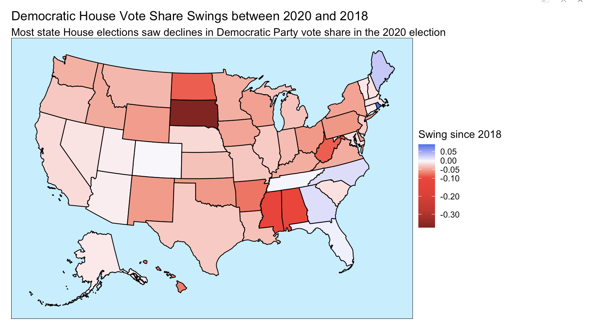

# Introduction
This is blog post #1 in a series of analytical posts about the 2022 midterms. This post is affiliated with Gov 1347: Election Analytics, a course at Harvard University in the Government department.

Over the next several weeks, I will be exploring previous U.S. elections data to analyze voter trends and behavior. This exploration will aide in my ultimate goal of forecasting the 2022 midterm election results. For this first blog, I focus on the House vote shares from 2016 to 2020 and how they changed over the course of Donald J. Trump's term. I compare the results of 2016 House election, specifically the House Democratic Party vote share at the state level, to those of the 2018 midterm House election to see the extent to which the common theme of incumbent disadvantage applied to the House election results. I then compare the House Democratic vote share of the 2018 election to the 2020 House election, which saw the election of Joseph R. Biden. **My hope is to identify the trends in House election swings in the Trump era. As we near the 2022 midterms, where the Democratic president's party is campaigning hard to retain House control, it'll be increasingly important to know which states have shown increased support for House Democrats in recent years.**

# House Races in 2016, 2018, and 2020
To answer this question, I pulled data about the House party vote shares for 2016, 2018, and 2020. I show 2018-2016 and 2020-2018 comparison maps, which consist of states colored by the quantity `$$\frac{D_y}{D_y + R_y} - \frac{D_{y - 2}}{D_{y - 2} + R_{y - 2}}$$`. This quantity is a measure of state swing in Democratic Party vote share for that House election, since the previous one. Below is the 2018-2016 swing map - negative (red) values show a decline in (D) House vote share in a given state since 2016, positive (blue) values show the opposite, and near-zero (white) values represent no change in (D) House vote. 

}}index_files/figure-html/unnamed-chunk-5-1.png" width="672" />

My analysis confirms that the House elections of the 2018 midterms followed the traditional pattern of the president's party performing rather poorly -- With the exception of Connecticut, Hawaii, Massachusetts, Vermont, and Wyoming, the Democrats gained vote share in every state in comparison to the 2016 House elections. This pattern of president's party disadvantage in midterms has been upheld at an incredibly high rate throughout the 20th and 21st century, and it is expected to hold in this year's midterm elections.

However, this swing against the executive party may reverse by the next House elections, and this was indeed true in 2020.

}}index_files/figure-html/unnamed-chunk-6-1.png" width="672" />
Unlike the previous swing comparison, the 2020-2018 comparison reveals that most states saw a decline in (D) party vote share in the House elections of 2020. Florida, Georgia, North Carolina, Rhode Island, and Maine were the only states to not see a decline in (D) House vote share. Georgia was an anomaly, and huge victory for the Democrats, in the 2020 elections, where less than 13,000 popular votes (Politico) determined Biden's victory in the electoral college and one House seat was flipped by the Democrats in district 7. Other than these 5 states, the Democrats lost vote share in nearly every state House election the Democrats but clinched the presidency by a decent margin (about 4 percentage points, Cook Political Report).

My dive into the 2018 and 2020 House election results and swings has revealed several observations: (1) Because the president's party has always been known to suffer during midterms, and this tradition remained true in the 2018 midterms, it should be expected that the Democrats see this same poor performance in November. (2) Looking beyond the midterms, Democrats may be relieved to hear that the president's party does seem to get some of their vote share back in House elections by the next general election. We saw that in 2020, House vote shares declined for Democrats in nearly all states. (3) It is important to study swings and temporally relative party performance to see how voters move in preference over different House elections, but it is also very important to study the House elections move in absolute terms -- although observation (2) recognized that the president's party does gain a lot of its lost House vote share back by the general election, 2020 showed us that this gain was ultimately not enough, with the challenger party taking the House, the Senate (by a hair), and the presidency. 

---

**References**

[1] Campbell, J. (2018a). Introduction: Forecasting the 2018 US Midterm Elections. https://doi.org/10.1017/S1049096518001592

[2] Walter, Amy (2020). 2020 National Popular Vote Tracker, https://www.cookpolitical.com/2020-national-popular-vote-tracker

[3] Vestal, James Allan, et al. (2020). Georgia Results 2020. https://www.politico.com/2020-election/results/georgia/
