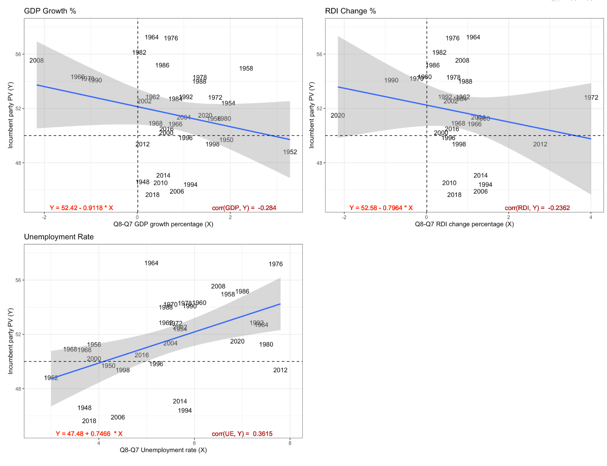
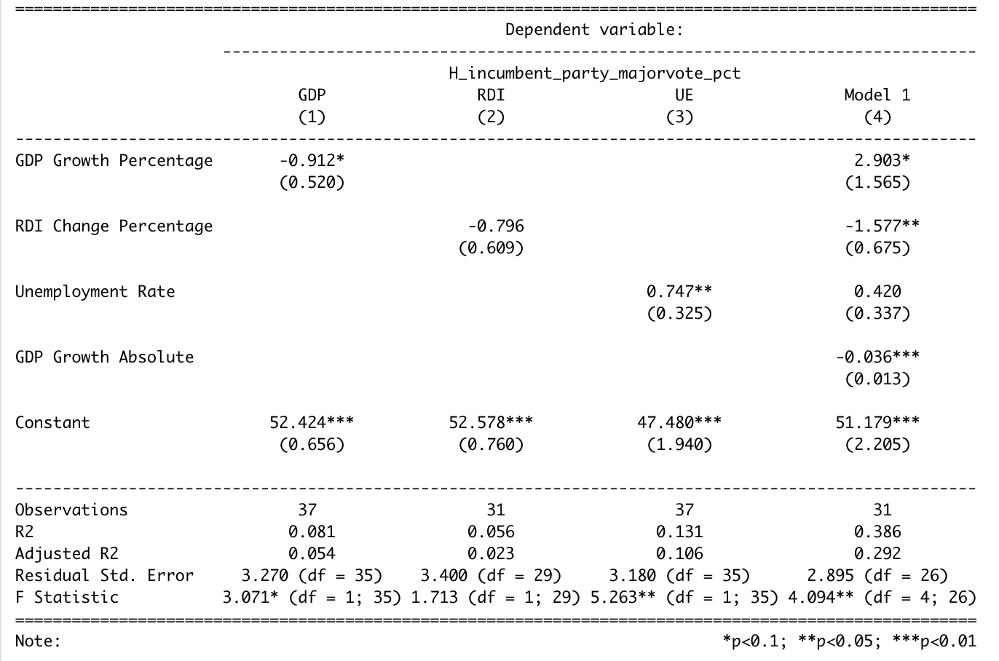
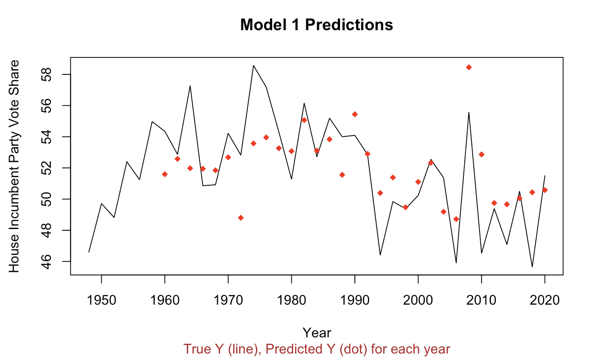
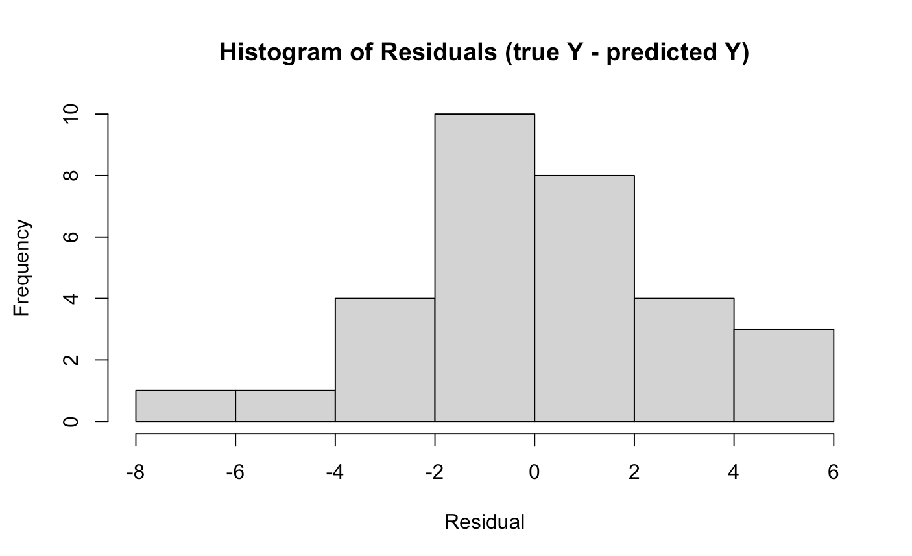
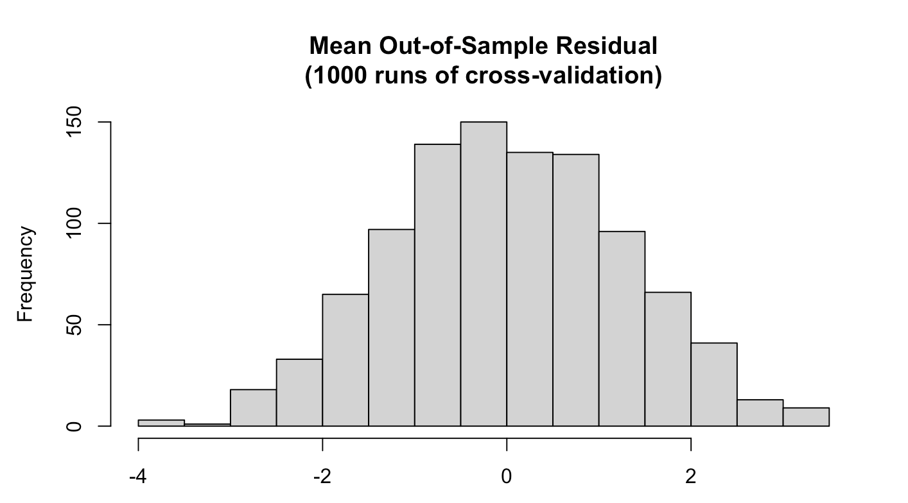

# Introduction
Last week, my dive into the 2018 election results and swings confirmed that the president's party often performs poorly in the midterms. By the 2020 House elections, the president's party gained some of its vote share back. 

This week, I temporarily move away from cyclical election study to delve into one of the most promising ways to predict election outcomes -- economics. Retrospective voting, a model of voting in which voters elect leaders based off of recent experiences and judgment of welfare under incumbent leadership, dictates that for many elections, the results largely rely on the state of the economy in the last quarter of the election cycle (Achen & Bartels, 2017). For presidential elections, this means that national economic variables like GDP (gross domestic product), unemployment, and RDI (real disposable income) can account for a lot of the variation in incumbent candidate popularity. **I explore this relationship between national economic variables and incumbent vote share, but for House races from 1948 to 2020. I want to know which variables accurately predict House incumbent party vote share, and build a model accordingly. Lastly, I will test my model with data from 2020 to see how well it would've predicted the last election.** 

# GDP, RDI, and Unemployment
To start identifying which national economic variables predict House incumbent vote share well, I first investigated how Quarter 8 GDP growth (percentage), RDI change (percentage), and unemployment rate, individually, are related to incumbent party vote share. I specifically choose Quarter 8 because voters often refer to the latest memory they have of the economy to judge how the economy has performed under their incumbent leader(s) (Achen & Bartels, 2017. Healy & Lenz, 2014).

As shown above, each variable, GDP growth, RDI change, and unemployment rate, respectively, are correlated to House incumbent vote share - as GDP growth percentage decreases, or RDI change percentage decreases, or unemployment rate grows, House incumbent vote share grows. These correlations are unintuitive, and suggest that voters do not accurately hold their leaders accountable according to national economic performance. 

That said, these correlations are not too explanatory by themselves and may be very susceptible to noise, with R-squared values of 0.081, 0.056, and 0.131. I moved on from univariate relationships between these national economic variables House incumbent vote share to multivariable relationships, hoping to find a model that incorporates multiple economic variables to predict incumbent vote share. In this multivariable model (which I call Model 1), I consider the predictors `GDP_growth_pct` (GDP growth %), `DSPIC_change_pct` (RDI change %), `GDP_growth_qt` (GDP growth), and `UNRATE` (unemployment rate) to investigate how they influence incumbent vote share in conjunction. 

# Model 1
My development of Model 1 finds that GDP, RDI, and unemployment all influence House incumbent vote share, but in varying directions and with varying levels of statistical significance. For GDP growth (%), Model 1 anticipates that as it grows by 1, House incumbent vote share will too by 2.9, which makes more sense. However, for GDP growth (absolute) and unemployment rate, increases in these are still associated with decreases in incumbent vote share. 

These results are again fascinating, as they are counter-intuitive and don't follow the traditional knowledge political scientists lean on concerning retrospective voting, economic performance, and incumbent success. That said, Model 1 has an R-squared value of 0.386, which is much higher than the univariate R-squared values previously found. 

}}index_files/figure-html/unnamed-chunk-5-1.png" width="672" style="display: block; margin: auto;" />

To evaluate the performance of my model and choice of model, I check the residuals. As shown below, they are roughly normally distributed around a center point of 0. This tells me that the form of Model 1 (linear) is adequate.

}}index_files/figure-html/unnamed-chunk-6-1.png" width="672" style="display: block; margin: auto;" />

}}index_files/figure-html/unnamed-chunk-8-1.png" width="672" style="display: block; margin: auto;" />
After checking that Model 1 performs well after being tested with 1,000 runs of cross-validation, with a mean-error of roughly 0, I move to applying Model 1 to the most recent data available for the national economic variables in the model. This data comes from Q2 2022, which is equivalent to Q6 of the current House. The reports indicate that in Q2 (or Q6), there was a -0.6% change in GDP, -0.6% change in RDI, -28.453 absolute change in GDPC1 (Real GDP, measured in billions of chained 2012 Dollars), and 3.6 national unemployment rate. **With these inputs, Model 1 predicts that the incumbent party in the House (the Democratic Party) will have a vote share of 52.92% (50.20, 55.64).** 

This prediction is probably an overestimate given the fact that Model 1 did not account for the negative incumbent-midterm effect. Additionally, Model 1 should be used again once Q8 (so, Q4 of 2022) data becomes available to maximize its predictive power. The model can also be improved with wider purview into House incumbent seat share and totals. Lastly, Wright found that worsened (so, increased) unemployment affects Democrats differently than it does Republicans. Given more time, I would expore if this finding holds when we focus specifically on House elections.

---

**References**

[1] Achen, & Bartels, L. M. (2017). Democracy for realists (REV - Revised). Princeton University Press.
https://muse.jhu.edu/book/64646

[2] Healy, & Lenz, G. S. (2014). Substituting the End for the Whole: Why Voters Respond Primarily to the Election-Year Economy. American Journal of Political Science, 58(1), 31–47. https://doi.org/10.1111/ajps.12053

[3] Wright. (2012). Unemployment and the Democratic Electoral Advantage. The American Political Science Review, 106(4), 685–702. https://doi.org/10.1017/S0003055412000330

[4] Rakich, N., & Mejia, E. (2022, March 31). The house map's Republican bias will plummet in 2022 - because of gerrymandering. FiveThirtyEight.  https://fivethirtyeight.com/features/the-house-maps-republican-bias-will-plummet-in-2022-because-of-gerrymandering/ 

[5] BEA. Gross Domestic Product. https://www.bea.gov/data/gdp/gross-domestic-product

[6] BEA. Gross Domestic Product Second Quarter 2022. https://www.bea.gov/news/2022/gross-domestic-product-second-quarter-2022-advance-estimate

[7] FRED. GDPC1. https://fred.stlouisfed.org/series/GDPC1

[8] Trading Economics. Unemployment Rate. https://tradingeconomics.com/united-states/unemployment-rate
