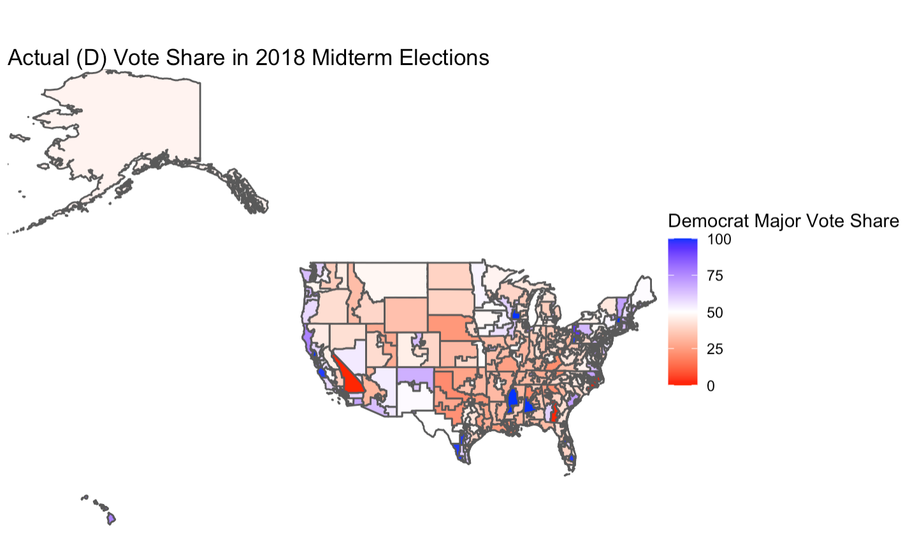

# The Plan This Week

Last week, I took a close look at The Economist’s and FiveThirtyEight’s House forecast models and their methodology, and compared them. With these models in mind, I updated my own 2022 midterm forecast and model to include national economic conditions (Gross Domestic Product, Real Disposable Income, and unemployment), generic ballot polls (partisan preference), and the midterm-president’s-party effect.

One of the most interesting differences between the two models was that FiveThirtyEight explicitly mentions their use of expert forecasts ([Cook Political Report](https://www.cookpolitical.com/ratings/house-race-ratings), [Inside Elections](https://insideelections.com/ratings/house), and [Sabato’s Crystal Ball](https://centerforpolitics.org/crystalball/2022-house/)) to predict future elections. Expert forecasts are intuitively a strong predictor of the race outcomes, as they are the best predictions elections experts have given all they data they gathered. This week, I wanted to investigate how accurate these expert predictions really are, specifically for the 2018 midterms.

# How Accurate Are Expert Predictions?

To conduct this week’s investigation, I compare the actual results of the 2018 midterm elections to the average election ratings of experts. The 2018 results shown below are Democrat vote shares in each district. The 2018 expert election ratings come from [Ballotpedia](https://ballotpedia.org/Main_Page), with the election ratings taking on integer values 1 through 7 – 1 represents a Solid/Safe Democrat prediction and 7 represents a Solid/Safe Republican average expert prediction for each district.

## Actual Vote Share in 2018, by District

Below is the actual (D) vote share in the 2018 midterm elections at the district level.

<figure>

<figcaption aria-hidden="true">Actual 2018 (D) Vote Share.</figcaption>
</figure>

Most of the map is either red or white, which seems to suggest that most district vote share results were in the Republican party’s favor or close between the two major parties. However, it is important to remember that for the House of Representatives, land is not proportional to representation, population is. Also, the president’s party often performs poorly in midterm years, as discussed in detail in the [first blog post](https://vivian-1372.github.io/Election-Analytics/post/2022-09-15-analzying-2020-house-vote-shares/) of this series. Those two reminders considered, it then makes sense that the Democrats actually took the House in the 2018 midterms, with 235 seats going to Democrats and 199 going to Republicans (New York Times 2018).

## Expert Predictions for Vote Share in 2018, by District

Below are the expert ratings for the 2018 midterms, which I call predictions because the ratings reflect what the experts believed would happen in each congressional district election. Red areas represent high expert confidence that the region will go to Republicans, while blue areas represent high confidence that the region will go to Democrats.

## Evaluation

For the most part, the predictions are pretty accurate via visual investigation. Most of the areas that actually had majority-Republican vote shares in the 2018 elections were predicted to be likely or solidly Republican by the experts on average. The blue districts of the 2018 midterms, like the ones along the west coast of Washington, Oregon, and California, in Arizona and New Mexico, in southern Texas, and scattered throughout the Rust Belt, were impressively predicted by the experts and their ratings, reflected in the standout blue coloring in the plot above. The experts were also able to pin down the close races, like the ones in southern New Mexico and in Maine. Overall, I think the average expert ratings predicted the congressional races at the district level very well, despite being just one predictor (that is a culmination of many predictors considered by the experts) in my model.

# My 2022 Model and Forecast, Updated

## My New Model

My national model remains the same as it was last week, and I cannot fully extend my national model to the district level because it uses national variables like GDP change, as well as national responses to the generic ballot polls. That said, I can incorporate this week’s investigation into a district-level model that predicts the House races by district using the most recent expert ratings data I have access to. These district-level models are of course imperfect because they only use expert ratings, but across all of them, they have an average R-squared of 0.78.

## My New Forecast

Below are my models’ predictions for the major vote share taken by Democrats for the 94 congressional districts where the expert ratings were available.

<table class="gt_table">
  &#10;  <thead class="gt_col_headings">
    <tr>
      <th class="gt_col_heading gt_columns_bottom_border gt_left" rowspan="1" colspan="1" scope="col" id="state">state</th>
      <th class="gt_col_heading gt_columns_bottom_border gt_center" rowspan="1" colspan="1" scope="col" id="district">district</th>
      <th class="gt_col_heading gt_columns_bottom_border gt_center" rowspan="1" colspan="1" scope="col" id="pred">pred</th>
    </tr>
  </thead>
  <tbody class="gt_table_body">
    <tr><td headers="state" class="gt_row gt_left">Alaska</td>
<td headers="district" class="gt_row gt_center">AL</td>
<td headers="pred" class="gt_row gt_center">48.03</td></tr>
    <tr><td headers="state" class="gt_row gt_left">Arizona</td>
<td headers="district" class="gt_row gt_center">1</td>
<td headers="pred" class="gt_row gt_center">51.30</td></tr>
    <tr><td headers="state" class="gt_row gt_left">Arizona</td>
<td headers="district" class="gt_row gt_center">2</td>
<td headers="pred" class="gt_row gt_center">49.10</td></tr>
    <tr><td headers="state" class="gt_row gt_left">Arizona</td>
<td headers="district" class="gt_row gt_center">6</td>
<td headers="pred" class="gt_row gt_center">48.19</td></tr>
    <tr><td headers="state" class="gt_row gt_left">California</td>
<td headers="district" class="gt_row gt_center">21</td>
<td headers="pred" class="gt_row gt_center">48.30</td></tr>
    <tr><td headers="state" class="gt_row gt_left">California</td>
<td headers="district" class="gt_row gt_center">22</td>
<td headers="pred" class="gt_row gt_center">60.08</td></tr>
    <tr><td headers="state" class="gt_row gt_left">California</td>
<td headers="district" class="gt_row gt_center">25</td>
<td headers="pred" class="gt_row gt_center">58.31</td></tr>
    <tr><td headers="state" class="gt_row gt_left">California</td>
<td headers="district" class="gt_row gt_center">26</td>
<td headers="pred" class="gt_row gt_center">54.77</td></tr>
    <tr><td headers="state" class="gt_row gt_left">California</td>
<td headers="district" class="gt_row gt_center">3</td>
<td headers="pred" class="gt_row gt_center">49.02</td></tr>
    <tr><td headers="state" class="gt_row gt_left">California</td>
<td headers="district" class="gt_row gt_center">45</td>
<td headers="pred" class="gt_row gt_center">51.94</td></tr>
    <tr><td headers="state" class="gt_row gt_left">California</td>
<td headers="district" class="gt_row gt_center">47</td>
<td headers="pred" class="gt_row gt_center">58.68</td></tr>
    <tr><td headers="state" class="gt_row gt_left">California</td>
<td headers="district" class="gt_row gt_center">49</td>
<td headers="pred" class="gt_row gt_center">50.06</td></tr>
    <tr><td headers="state" class="gt_row gt_left">California</td>
<td headers="district" class="gt_row gt_center">9</td>
<td headers="pred" class="gt_row gt_center">56.05</td></tr>
    <tr><td headers="state" class="gt_row gt_left">Colorado</td>
<td headers="district" class="gt_row gt_center">3</td>
<td headers="pred" class="gt_row gt_center">48.72</td></tr>
    <tr><td headers="state" class="gt_row gt_left">Colorado</td>
<td headers="district" class="gt_row gt_center">7</td>
<td headers="pred" class="gt_row gt_center">55.14</td></tr>
    <tr><td headers="state" class="gt_row gt_left">Connecticut</td>
<td headers="district" class="gt_row gt_center">4</td>
<td headers="pred" class="gt_row gt_center">49.58</td></tr>
    <tr><td headers="state" class="gt_row gt_left">Connecticut</td>
<td headers="district" class="gt_row gt_center">5</td>
<td headers="pred" class="gt_row gt_center">51.77</td></tr>
    <tr><td headers="state" class="gt_row gt_left">Florida</td>
<td headers="district" class="gt_row gt_center">13</td>
<td headers="pred" class="gt_row gt_center">49.10</td></tr>
    <tr><td headers="state" class="gt_row gt_left">Florida</td>
<td headers="district" class="gt_row gt_center">15</td>
<td headers="pred" class="gt_row gt_center">48.92</td></tr>
    <tr><td headers="state" class="gt_row gt_left">Florida</td>
<td headers="district" class="gt_row gt_center">16</td>
<td headers="pred" class="gt_row gt_center">42.36</td></tr>
    <tr><td headers="state" class="gt_row gt_left">Florida</td>
<td headers="district" class="gt_row gt_center">2</td>
<td headers="pred" class="gt_row gt_center">52.57</td></tr>
    <tr><td headers="state" class="gt_row gt_left">Florida</td>
<td headers="district" class="gt_row gt_center">22</td>
<td headers="pred" class="gt_row gt_center">47.55</td></tr>
    <tr><td headers="state" class="gt_row gt_left">Florida</td>
<td headers="district" class="gt_row gt_center">27</td>
<td headers="pred" class="gt_row gt_center">48.87</td></tr>
    <tr><td headers="state" class="gt_row gt_left">Florida</td>
<td headers="district" class="gt_row gt_center">7</td>
<td headers="pred" class="gt_row gt_center">51.79</td></tr>
    <tr><td headers="state" class="gt_row gt_left">Georgia</td>
<td headers="district" class="gt_row gt_center">12</td>
<td headers="pred" class="gt_row gt_center">53.79</td></tr>
    <tr><td headers="state" class="gt_row gt_left">Georgia</td>
<td headers="district" class="gt_row gt_center">6</td>
<td headers="pred" class="gt_row gt_center">52.09</td></tr>
    <tr><td headers="state" class="gt_row gt_left">Illinois</td>
<td headers="district" class="gt_row gt_center">11</td>
<td headers="pred" class="gt_row gt_center">50.91</td></tr>
    <tr><td headers="state" class="gt_row gt_left">Illinois</td>
<td headers="district" class="gt_row gt_center">13</td>
<td headers="pred" class="gt_row gt_center">49.98</td></tr>
    <tr><td headers="state" class="gt_row gt_left">Illinois</td>
<td headers="district" class="gt_row gt_center">14</td>
<td headers="pred" class="gt_row gt_center">49.43</td></tr>
    <tr><td headers="state" class="gt_row gt_left">Illinois</td>
<td headers="district" class="gt_row gt_center">17</td>
<td headers="pred" class="gt_row gt_center">49.32</td></tr>
    <tr><td headers="state" class="gt_row gt_left">Illinois</td>
<td headers="district" class="gt_row gt_center">6</td>
<td headers="pred" class="gt_row gt_center">53.55</td></tr>
    <tr><td headers="state" class="gt_row gt_left">Illinois</td>
<td headers="district" class="gt_row gt_center">8</td>
<td headers="pred" class="gt_row gt_center">51.17</td></tr>
    <tr><td headers="state" class="gt_row gt_left">Iowa</td>
<td headers="district" class="gt_row gt_center">1</td>
<td headers="pred" class="gt_row gt_center">47.23</td></tr>
    <tr><td headers="state" class="gt_row gt_left">Iowa</td>
<td headers="district" class="gt_row gt_center">2</td>
<td headers="pred" class="gt_row gt_center">48.58</td></tr>
    <tr><td headers="state" class="gt_row gt_left">Iowa</td>
<td headers="district" class="gt_row gt_center">3</td>
<td headers="pred" class="gt_row gt_center">47.41</td></tr>
    <tr><td headers="state" class="gt_row gt_left">Kansas</td>
<td headers="district" class="gt_row gt_center">3</td>
<td headers="pred" class="gt_row gt_center">48.34</td></tr>
    <tr><td headers="state" class="gt_row gt_left">Maine</td>
<td headers="district" class="gt_row gt_center">2</td>
<td headers="pred" class="gt_row gt_center">47.16</td></tr>
    <tr><td headers="state" class="gt_row gt_left">Maryland</td>
<td headers="district" class="gt_row gt_center">6</td>
<td headers="pred" class="gt_row gt_center">70.30</td></tr>
    <tr><td headers="state" class="gt_row gt_left">Michigan</td>
<td headers="district" class="gt_row gt_center">11</td>
<td headers="pred" class="gt_row gt_center">49.35</td></tr>
    <tr><td headers="state" class="gt_row gt_left">Michigan</td>
<td headers="district" class="gt_row gt_center">3</td>
<td headers="pred" class="gt_row gt_center">47.56</td></tr>
    <tr><td headers="state" class="gt_row gt_left">Michigan</td>
<td headers="district" class="gt_row gt_center">7</td>
<td headers="pred" class="gt_row gt_center">45.56</td></tr>
    <tr><td headers="state" class="gt_row gt_left">Michigan</td>
<td headers="district" class="gt_row gt_center">8</td>
<td headers="pred" class="gt_row gt_center">48.92</td></tr>
    <tr><td headers="state" class="gt_row gt_left">Minnesota</td>
<td headers="district" class="gt_row gt_center">1</td>
<td headers="pred" class="gt_row gt_center">49.60</td></tr>
    <tr><td headers="state" class="gt_row gt_left">Minnesota</td>
<td headers="district" class="gt_row gt_center">2</td>
<td headers="pred" class="gt_row gt_center">49.52</td></tr>
    <tr><td headers="state" class="gt_row gt_left">Minnesota</td>
<td headers="district" class="gt_row gt_center">3</td>
<td headers="pred" class="gt_row gt_center">49.31</td></tr>
    <tr><td headers="state" class="gt_row gt_left">Minnesota</td>
<td headers="district" class="gt_row gt_center">8</td>
<td headers="pred" class="gt_row gt_center">50.25</td></tr>
    <tr><td headers="state" class="gt_row gt_left">Missouri</td>
<td headers="district" class="gt_row gt_center">2</td>
<td headers="pred" class="gt_row gt_center">46.53</td></tr>
    <tr><td headers="state" class="gt_row gt_left">Nebraska</td>
<td headers="district" class="gt_row gt_center">2</td>
<td headers="pred" class="gt_row gt_center">50.03</td></tr>
    <tr><td headers="state" class="gt_row gt_left">Nevada</td>
<td headers="district" class="gt_row gt_center">3</td>
<td headers="pred" class="gt_row gt_center">50.07</td></tr>
    <tr><td headers="state" class="gt_row gt_left">Nevada</td>
<td headers="district" class="gt_row gt_center">4</td>
<td headers="pred" class="gt_row gt_center">52.93</td></tr>
    <tr><td headers="state" class="gt_row gt_left">New Hampshire</td>
<td headers="district" class="gt_row gt_center">1</td>
<td headers="pred" class="gt_row gt_center">49.69</td></tr>
    <tr><td headers="state" class="gt_row gt_left">New Hampshire</td>
<td headers="district" class="gt_row gt_center">2</td>
<td headers="pred" class="gt_row gt_center">51.32</td></tr>
    <tr><td headers="state" class="gt_row gt_left">New Jersey</td>
<td headers="district" class="gt_row gt_center">11</td>
<td headers="pred" class="gt_row gt_center">60.44</td></tr>
    <tr><td headers="state" class="gt_row gt_left">New Jersey</td>
<td headers="district" class="gt_row gt_center">2</td>
<td headers="pred" class="gt_row gt_center">46.43</td></tr>
    <tr><td headers="state" class="gt_row gt_left">New Jersey</td>
<td headers="district" class="gt_row gt_center">3</td>
<td headers="pred" class="gt_row gt_center">49.77</td></tr>
    <tr><td headers="state" class="gt_row gt_left">New Jersey</td>
<td headers="district" class="gt_row gt_center">5</td>
<td headers="pred" class="gt_row gt_center">50.37</td></tr>
    <tr><td headers="state" class="gt_row gt_left">New Jersey</td>
<td headers="district" class="gt_row gt_center">7</td>
<td headers="pred" class="gt_row gt_center">49.27</td></tr>
    <tr><td headers="state" class="gt_row gt_left">New Mexico</td>
<td headers="district" class="gt_row gt_center">1</td>
<td headers="pred" class="gt_row gt_center">50.81</td></tr>
    <tr><td headers="state" class="gt_row gt_left">New Mexico</td>
<td headers="district" class="gt_row gt_center">2</td>
<td headers="pred" class="gt_row gt_center">48.27</td></tr>
    <tr><td headers="state" class="gt_row gt_left">New York</td>
<td headers="district" class="gt_row gt_center">1</td>
<td headers="pred" class="gt_row gt_center">48.92</td></tr>
    <tr><td headers="state" class="gt_row gt_left">New York</td>
<td headers="district" class="gt_row gt_center">11</td>
<td headers="pred" class="gt_row gt_center">45.26</td></tr>
    <tr><td headers="state" class="gt_row gt_left">New York</td>
<td headers="district" class="gt_row gt_center">18</td>
<td headers="pred" class="gt_row gt_center">51.87</td></tr>
    <tr><td headers="state" class="gt_row gt_left">New York</td>
<td headers="district" class="gt_row gt_center">19</td>
<td headers="pred" class="gt_row gt_center">48.23</td></tr>
    <tr><td headers="state" class="gt_row gt_left">New York</td>
<td headers="district" class="gt_row gt_center">2</td>
<td headers="pred" class="gt_row gt_center">46.52</td></tr>
    <tr><td headers="state" class="gt_row gt_left">New York</td>
<td headers="district" class="gt_row gt_center">22</td>
<td headers="pred" class="gt_row gt_center">48.60</td></tr>
    <tr><td headers="state" class="gt_row gt_left">New York</td>
<td headers="district" class="gt_row gt_center">25</td>
<td headers="pred" class="gt_row gt_center">49.11</td></tr>
    <tr><td headers="state" class="gt_row gt_left">New York</td>
<td headers="district" class="gt_row gt_center">3</td>
<td headers="pred" class="gt_row gt_center">46.90</td></tr>
    <tr><td headers="state" class="gt_row gt_left">New York</td>
<td headers="district" class="gt_row gt_center">4</td>
<td headers="pred" class="gt_row gt_center">53.23</td></tr>
    <tr><td headers="state" class="gt_row gt_left">North Carolina</td>
<td headers="district" class="gt_row gt_center">13</td>
<td headers="pred" class="gt_row gt_center">48.93</td></tr>
    <tr><td headers="state" class="gt_row gt_left">North Carolina</td>
<td headers="district" class="gt_row gt_center">6</td>
<td headers="pred" class="gt_row gt_center">53.43</td></tr>
    <tr><td headers="state" class="gt_row gt_left">North Carolina</td>
<td headers="district" class="gt_row gt_center">7</td>
<td headers="pred" class="gt_row gt_center">51.02</td></tr>
    <tr><td headers="state" class="gt_row gt_left">North Carolina</td>
<td headers="district" class="gt_row gt_center">9</td>
<td headers="pred" class="gt_row gt_center">49.77</td></tr>
    <tr><td headers="state" class="gt_row gt_left">Ohio</td>
<td headers="district" class="gt_row gt_center">1</td>
<td headers="pred" class="gt_row gt_center">46.03</td></tr>
    <tr><td headers="state" class="gt_row gt_left">Ohio</td>
<td headers="district" class="gt_row gt_center">10</td>
<td headers="pred" class="gt_row gt_center">20.01</td></tr>
    <tr><td headers="state" class="gt_row gt_left">Ohio</td>
<td headers="district" class="gt_row gt_center">13</td>
<td headers="pred" class="gt_row gt_center">58.82</td></tr>
    <tr><td headers="state" class="gt_row gt_left">Ohio</td>
<td headers="district" class="gt_row gt_center">15</td>
<td headers="pred" class="gt_row gt_center">47.43</td></tr>
    <tr><td headers="state" class="gt_row gt_left">Ohio</td>
<td headers="district" class="gt_row gt_center">7</td>
<td headers="pred" class="gt_row gt_center">62.47</td></tr>
    <tr><td headers="state" class="gt_row gt_left">Oregon</td>
<td headers="district" class="gt_row gt_center">5</td>
<td headers="pred" class="gt_row gt_center">52.66</td></tr>
    <tr><td headers="state" class="gt_row gt_left">Pennsylvania</td>
<td headers="district" class="gt_row gt_center">1</td>
<td headers="pred" class="gt_row gt_center">50.84</td></tr>
    <tr><td headers="state" class="gt_row gt_left">Pennsylvania</td>
<td headers="district" class="gt_row gt_center">10</td>
<td headers="pred" class="gt_row gt_center">46.13</td></tr>
    <tr><td headers="state" class="gt_row gt_left">Pennsylvania</td>
<td headers="district" class="gt_row gt_center">12</td>
<td headers="pred" class="gt_row gt_center">48.24</td></tr>
    <tr><td headers="state" class="gt_row gt_left">Pennsylvania</td>
<td headers="district" class="gt_row gt_center">17</td>
<td headers="pred" class="gt_row gt_center">41.72</td></tr>
    <tr><td headers="state" class="gt_row gt_left">Pennsylvania</td>
<td headers="district" class="gt_row gt_center">6</td>
<td headers="pred" class="gt_row gt_center">51.10</td></tr>
    <tr><td headers="state" class="gt_row gt_left">Pennsylvania</td>
<td headers="district" class="gt_row gt_center">7</td>
<td headers="pred" class="gt_row gt_center">48.00</td></tr>
    <tr><td headers="state" class="gt_row gt_left">Pennsylvania</td>
<td headers="district" class="gt_row gt_center">8</td>
<td headers="pred" class="gt_row gt_center">47.94</td></tr>
    <tr><td headers="state" class="gt_row gt_left">South Carolina</td>
<td headers="district" class="gt_row gt_center">1</td>
<td headers="pred" class="gt_row gt_center">49.78</td></tr>
    <tr><td headers="state" class="gt_row gt_left">Texas</td>
<td headers="district" class="gt_row gt_center">23</td>
<td headers="pred" class="gt_row gt_center">49.28</td></tr>
    <tr><td headers="state" class="gt_row gt_left">Virginia</td>
<td headers="district" class="gt_row gt_center">10</td>
<td headers="pred" class="gt_row gt_center">48.25</td></tr>
    <tr><td headers="state" class="gt_row gt_left">Virginia</td>
<td headers="district" class="gt_row gt_center">2</td>
<td headers="pred" class="gt_row gt_center">50.30</td></tr>
    <tr><td headers="state" class="gt_row gt_left">Virginia</td>
<td headers="district" class="gt_row gt_center">5</td>
<td headers="pred" class="gt_row gt_center">48.37</td></tr>
    <tr><td headers="state" class="gt_row gt_left">Virginia</td>
<td headers="district" class="gt_row gt_center">7</td>
<td headers="pred" class="gt_row gt_center">50.98</td></tr>
    <tr><td headers="state" class="gt_row gt_left">Washington</td>
<td headers="district" class="gt_row gt_center">3</td>
<td headers="pred" class="gt_row gt_center">50.43</td></tr>
    <tr><td headers="state" class="gt_row gt_left">Washington</td>
<td headers="district" class="gt_row gt_center">8</td>
<td headers="pred" class="gt_row gt_center">50.44</td></tr>
    <tr><td headers="state" class="gt_row gt_left">Wisconsin</td>
<td headers="district" class="gt_row gt_center">3</td>
<td headers="pred" class="gt_row gt_center">44.73</td></tr>
  </tbody>
  <tfoot class="gt_sourcenotes">
    <tr>
      <td class="gt_sourcenote" colspan="3"></td>
    </tr>
  </tfoot>
  &#10;</table>

------------------------------------------------------------------------

**References**

\[1\] Ballotpedia. (2022). https://ballotpedia.org/Main_Page

\[2\] Cook Political Report. (2002). House Race Ratings. https://www.cookpolitical.com/ratings/house-race-ratings

\[3\] Inside Elections. (2022). House Ratings. https://insideelections.com/ratings/house

\[4\] Sabato’s Crystal Ball. (2022). House Race Ratings. https://centerforpolitics.org/crystalball/2022-house/

\[5\] The New York Times. (2018, November 6). U.S. House election results 2018. The New York Times. https://www.nytimes.com/interactive/2018/11/06/us/elections/results-house-elections.html
