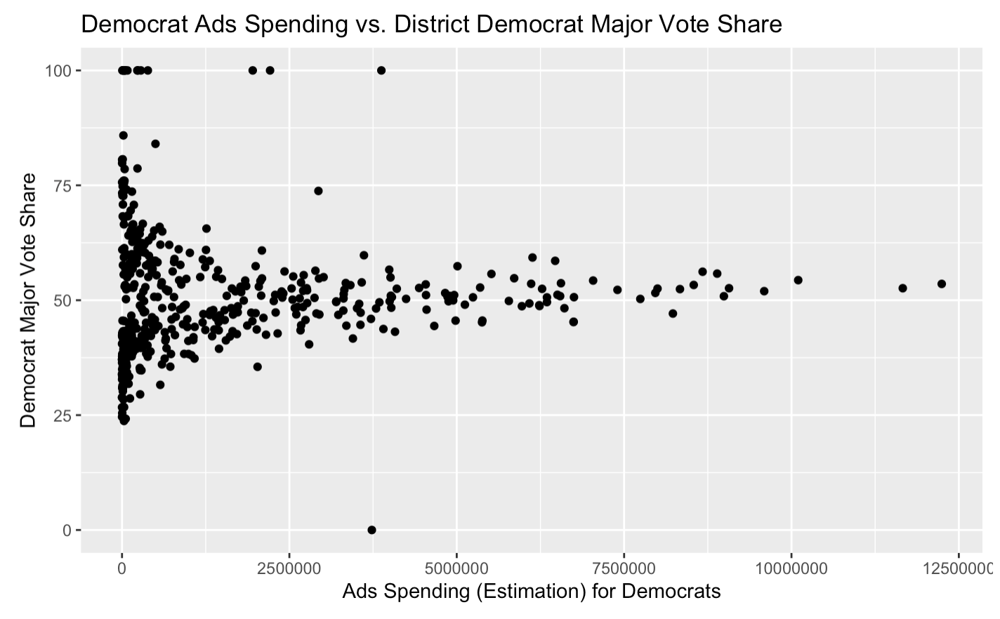
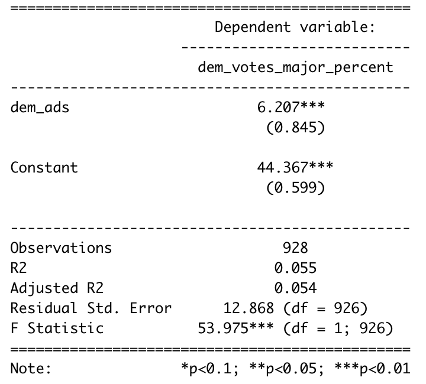

## The Plan This Week
We are about 4 weeks out from Election Day, and thus far I've created a national forecasting model that incorporates national economic conditions (Gross Domestic Product, Real Disposable Income, and unemployment), generic ballot polling (partisan preference), and the midterm-president's-party effect. I've also created a simple district-level forecasting model based on expert ratings ([Cook Political Report](https://www.cookpolitical.com/ratings/house-race
-ratings), [Inside Elections](https://insideelections.com/ratings/house), and [Sabato's Crystal Ball](https://centerforpolitics.org/crystalball/2022-house/)).  
This week I plan to explore the impact of advertisements (volume, cost) on the outcomes of congressional races. After evaluating the historical impact of "the Air War" on elections, I plan to update my simple district-level model from last week.  

## Are Advertisements Impactful?
To explore this week’s central question, I took a look at data from the [Wesleyan Media Project](https://mediaproject.wesleyan.edu/) about political campaign advertisements for campaigns from 2006 through 2018. 

I first wanted to visually inspect the relationship between advertisement volume and party major vote share at the district level for House races, and found unpromising results. 

As shown in the above 2 plots, there’s no clear correlation between the number of partisan advertisements run and the party’s major vote share in a given district. As the number of advertisements run for each party increases, the party’s major vote share doesn’t increase or decrease. 

Though there’s no positive or negative correlation that immediately jumps out from these plots, there are still valuable insights to note. For one, there’s great variability in party vote share when there are a low number of advertisements run in that district - with close to 0 ads run for the Democrat candidate in a district, the candidate can have anywhere from 25% to 100% of the vote share. The same is true for Republican candidates and lack of Republican advertisements.  As the numbers of advertisement run increases, towards the magnitudes of 15,000 and beyond, the races become much more competitive, with each party securing about 50% of the major party vote share. This finding is intuitive, in a way, because we could imagine the reason these districts were sites of unprecedented advertisement war was because their races were highly competitive and anticipated.

I was also curious about spending on advertisements versus the promoted candidate’s vote share. Below is the plot of the total estimated cost of advertisements promoting a Democratic candidate against the amount of money spent on their advertising campaign. The same trends from above apply here – at the lower end of advertisement campaign strength and cost, the Democrat major vote share varies widely across different House races. At the higher end of spending, the races remain competitive, with Democrats just edging out their competitors with vote shares hovering slightly above 50%.  

To formally check the relationship between advertisement volume and party major vote share in a district, I ran linear regressions across the districts with available data, predicting Democrat major vote share on the ratio of Democrat:Republican advertisements ran in that cycle. 

The results are interesting. The first observation is that the ratio of partisan advertisement volume alone is a poor predictor of Democrat vote share – my model only has an adjusted R-squared of 0.054. Another is that when the ratio of Democrat:Republican advertisements moves from 0 to 1, the Democrat vote share increases by ~6.2 percentage points. 

## Evaluation and Looking Forward
6.2 is, of course, a huge increase in major vote share, but the way I built my model hinders interpretability and generalization because I can only make the +6.2 p.p. claim when the advertisement situation goes from no Democrat advertisements to all Democrat advertisements in a district. All things considered, I plan to rethink the way I evaluate advertisement data as a predictor of historical races before incorporating it into my district-level model. Right now, I hesitate to add it to my model in addition to expert ratings because it may be better to scrap the variable altogether, considering the low predictive power advertisement volume has as a feature in my model. For now, I will refrain from making changes to my national and district-level models from last week, and I look forward to perhaps incorporating advertisement data in tandem with district-level candidate incumbency, or with other forms of candidate campaigning, like the ground game and its field offices, volunteers, rallies, and person-to-person contacts in the future. This week's exploration has revealed to me that the "Air War" is very real, but it's unclear how impactful it really is on candidate success in House races.  

---
**References**

[1] Cook Political Report. (2002). House Race Ratings. https://www.cookpolitical.com/ratings/house-race-ratings

[2] Inside Elections. (2022). House Ratings. https://insideelections.com/ratings/house

[3] Sabato's Crystal Ball. (2022). House Race Ratings. https://centerforpolitics.org/crystalball/2022-house/

[4] Wesleyan Media Project. https://mediaproject.wesleyan.edu/
