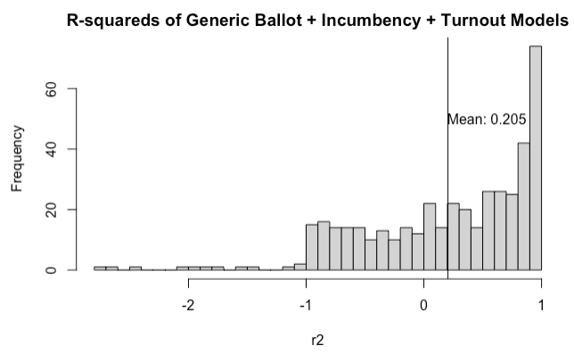
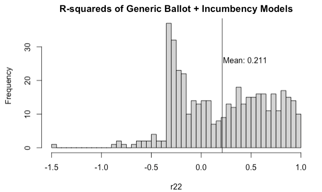
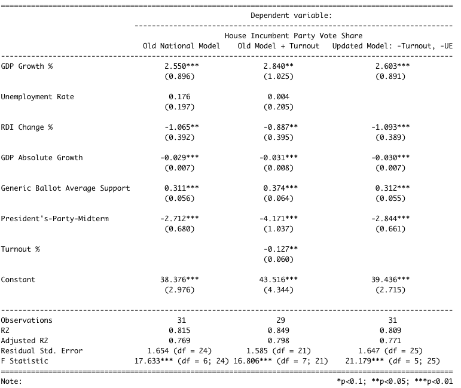

This is blog post #6 in a series of analytical posts about the 2022 midterms. This post is affiliated with Gov 1347: Election Analytics, a course at Harvard University in the Government department.

---

# The Plan This Week
Last week, I investigated the impact of television advertisements on party success at the district level, and found a small, arguably negligible, effect. This week, I delve into the other major side of campaign activities – “the ground game.” Do the phone banks, text banks, rallies, door knockers, and more matter? I will incorporate these findings and retroactive ones (expert predictions from [week 4](https://vivian-1372.github.io/Election-Analytics/post/2022-10-03-incumbency)) to make updates to my district-level model, newly featuring the effect of the ground game, expert predictions, and candidate incumbency. This will produce new district-level predictions for the races finalizing in the next 3 weeks!    

# The Ground Game
As mentioned in my discussion of campaigns last week, political campaigns aim to mobilize supporters to vote, persuade potential voters to cast their ballot in favor of certain candidates, and encourage donations. In a 2018 study, it was found that across 49 field experiments, “the best estimate of the effects of campaign contact and advertising on Americans’ candidates choices in general elections is zero” (Kalla and Broockman). At the end of this research paper, Kalla and Broockman assert that though the ground game doesn’t seem to persuade voters to change their vote choice, these ground campaigns matter in other ways. 

The consensus from the literature and pundit commentary is that the ground game – the fundraising, voter mobilization, person-to-person contact, field offices, and bottom-up political strategy of campaigns – does indeed matter. It certainly did for Obama, whose campaigns were studied extensively by political scientists. In 2012, turnout increased by about 7 percentage points in states that were highly-targeted by the ground arm of the major campaigns (Enos and Fowler, 2018). Even as early as 2008, President Obama’s campaigns were notably strong. [The Atlantic](https://www.theatlantic.com/politics/archive/2012/10/obamas-edge-the-ground-game-that-could-put-him-over-the-top/264031/) praised Obama’s “sophisticated organization,” which debuted in 2008 as “the largest grassroots organization in the history of American politics” (Ball, 2012). A 2009 study found that counties with Obama campaign field offices had disproportionate increases in Democratic vote share (Masket), and a 2014 study found that the field offices increased county-level vote share by 1%, which in turn scored Obama ~275,000 votes in the 2008 election (Darr and Levendusky). 

These findings suggest that successful ground campaigns increase turnout. In the remainder of my blog post this week, I want to explore the question of how increased turnout at the district level affects the parties’ respective vote shares, if at all? Does higher Democrat turnout correlate with better Democrat major vote share – which is rather intuitive –, or no – maybe higher Democrat turnout occurs with more Republican turnout, so there’s a “cancel-out” effect?  

# My 2022 Model and Forecast, Updated

My previous district-level model was basic, relying on only average expert predictions. Though the predictions themselves consider many important electoral predictors, their aggregation and then averaging render them basic. This week, I aim to Incorporate turnout, incumbency and the generic ballot into my district-level model of Democratic major vote share.

## My New Models
I took two shots at redesigning my district-level model: one incorporated candidate incumbency, district-level turnout, and generic ballot support (Model A: `DemVoteShare ~ incumbency + turnout + support`), and the other incorporated the aforementioned with the exception of turnout (Model B: `DemVoteShare ~ incumbency + support`). I also prioritized producing 435 models, so that limited my data to only 2012-present day data, but I aim to reconsider this in the next blog post as I grapple with the decision of including expert predictions in my district-level models. 

Below is a histogram of the adjusted R-squareds of Model A. 

As shown, there's generally a lot of room for improvement, with many R-squareds being 0 or even negative. Considering turnout, the generic ballot, and incumbency is at times worse than just using the mean Democratic vote share to predict the race outcomes! 

I was curious if the turnout variable, which is this week's proxy for the effect of the ground game, had significant predictive power. To test this quickly, I removed turnout as a predictor variable and developed a new set of 435 models. Below is the histogram of the adjusted R-squareds of Model B. 

This histogram, again, demonstrates the models have much room for improvement. Interestingly, removing the turnout predictor has not greatly reduced our R-squareds, with the average adjusted R-squared for Model B actually being higher than that of Model A. This one rudimentary test seems to suggest that turnout is not a great predictor of Democrat vote share; changes in turnout are not highly correlated with better or worse Democrat performance. 

I also tried to incorporate turnout into my national model. Below is the Stargazer table showing my regression outputs. On the left is the previous national model I developed in [week 3](https://vivian-1372.github.io/Election-Analytics/post/2022-09-26-polls-and-pollsters/), the middle is the new model with turnout incorporated, and on the right is the final national model I chose to come away from this week with. 

The upside of my national models regression is that 3 models is much easier to interpret and compare than 435. The first two columns show the coefficients for the old model, and the old model with turnout. As shown, adding turnout does not significantly change the adjusted R-squared of the model; in fact, adding turnout drives up the residual standard error. Additionally, turnout does not appear to be a significant predictor (0 stars) of House incumbent party (Democrats) vote share. I took these findings, as well as the observation that unemployment appears to be another poor predictor of vote share, to form my newest national model, which predicts House vote share for the incumbent House party using GDP growth %, RDI change %, GDP absolute growth %, the president's-party-midterm interaction, and generic ballot support. 

## My New Forecast
Next week, I hope to improve my district-level models by re-incorporating expert predictions. After some final touch-ups, I will produce new district-level predictions in time for Election Day.  

As for the national model, I was able to come up with new predictions using the newest iteration of my national model and the newest economic and generic ballot support data available online. The Democrats, as the incumbent majority party of the House, is expected to win 47.35% of the two-party major vote share, with 95% confidence interval (46.01, 48.68). I also built a model to predict incumbent seats using the same exact predictor variables, and predict taht the Democrats will win ~203 seats in a few weeks' time, with a confidence interval of (193, 213). 

---
**References**

[1] Kalla, & Broockman, D. E. (2018). The Minimal Persuasive Effects of Campaign Contact in General Elections: Evidence from 49 Field Experiments. The American Political Science Review, 112(1), 148–166. https://doi.org/10.1017/S0003055417000363

[2] Ball, M. (2012, October 25). Obama's edge: The ground game that could put him over the top. The Atlantic. https://www.theatlantic.com/politics/archive/2012/10/obamas-edge-the-ground-game-that-could-put-him-over-the-top/264031/) 

[3] Enos, & Fowler, A. (2018). Aggregate Effects of Large-Scale Campaigns on Voter Turnout. Political Science Research and Methods, 6(4), 733–751. https://doi.org/10.1017/psrm.2016.21

[4] Masket, Seth E. (2009). Did Obama’s Ground Game Matter? The Influence of Local Field Offices During the 2008 Presidential Election, Public Opinion Quarterly, 73(5), 1023–1039. https://doi.org/10.1093/poq/nfp077

[5] Darr, & Levendusky, M. S. (2014). Relying on the Ground Game. American Politics Research, 42(3), 529–548. https://doi.org/10.1177/1532673X13500520

[6] FiveThirtyEight. Generic Ballot. https://projects.fivethirtyeight.com/polls/generic-ballot/

[7] FRED. GDPC1. https://fred.stlouisfed.org/series/GDPC1
