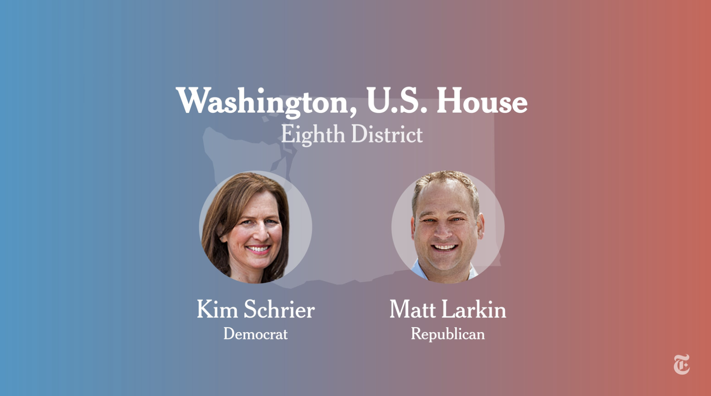

# Overview 
After months of studying the midterm elections at the national and district levels, we've gained a more complete understanding of the factors that predict incumbent party performance in terms of two-party vote share and seat wins. This week, I will take a deep dive into Washington's 8th congressional district to carefully analyze how its House race went after a brief review of the general characteristics of the district (including geography, demographics, candidates, electoral history) and its forecasted outcome per my models and those of the experts. I will then evaluate the forecasts' accuracies and the race's actual outcome, commenting on the campaigns ran and how they may have contributed to the outcome deviations from the forecasts.  

# Washington's 8th Congressional District 

Figure 1: Source: CNN.

## Fast Facts 
Directly east of Seattle and Tacoma (where I was born!), Washington's 8th congressional district is located in western Washington, covering most of King, Pierce, Chelan, Douglas, Snohomish, and Kittitas Counties. The region has a [Mediterranean climate](https://www.britannica.com/science/Mediterranean-climate#:~:text=Mediterranean%20climate%2C%20major%20climate%20type,western%20sides%20of%20the%20continents), with mild summers and moist winters (Choose Washington). Its geography is defined by the Cascade Mountain range, being home of the Mt. Baker National Forest, Wenatchee National Forest, Wenatchee Mountains, and part of the Mount Rainier National Park.        

As of the 2021 American Community Survey, WA-8 has a population of over 780,000 and is home to 284,410 households. The median age is 39.2, slightly higher than the U.S. median of 38.8. The sex ratio is 49:51 female:male. The average income is \$50,047 and the median household income is \$103,625, both considerably higher than the U.S. average and median of \$38,332 and \$69,717. This aligns with the heightened educational attainment of the district, with 92.7% of the population being high school graduates or higher and 39% holding bachelor's degrees or higher (compared to the U.S. averages of 89.4% and 35%) (Census Reporter). As of 2020, the district is 68.5% white, 9.6% Asian, 5.3% multiracial (non-Hispanic), 5% other (Hispanic), 4.8% white (Hispanic), 3% African American, 1.6% multiracial (Hispanic), 1% Native Hawaiian and PI, and 1% American Indian and Alaska Native (Data USA).  

WA-8 was created in the post-1980-Census redistricting cycle. Until 2003, it was mostly comprised of King and Pierce Counties. Between 2003 and 2013, the district was grew larger with the addition of Samarnish County. From 2013 until 2020, the district grew even larger with Chelan and Kittatas being added. CNN tracked the most recent changes after the 2020 redistricting cycle, shown below. 

Figure 2: Source: CNN.

Up until 2018, the district was a Republican stronghold for the House despite consistently electing a Democratic nominee for presidency since 1992 (Ballotpedia). In 2018, Kim Schrier (D) became the first Democrat to represent WA-8 after winning the race for the newly open seat against Republican Dino Rossi. Today, the district is described as "Washington's swingiest congressional district" (Seattle Times).

## 2022 Campaigns
For the 2022 midterms, WA-8 saw two major campaigns from Democratic incumbent Kim Schrier and Republican challenger Matt Larkin. 

Figure 3: Source: New York Times

### Background and Key Issues
Prior to serving in the House of Representatives, Kim Schrier, M.D., graduated from U.C. Berkeley with a degree in Astrophysics and had a successful career as a pediatrician in the Puget Sound region ([House site](https://schrier.house.gov/) and [campaign site](https://www.drkimschrier.com/)). For her 2022 re-election bid, she emphasized her efforts to increase affordable, quality healthcare, to protect women's rights, and to build a "middle-class centered economy." Whilst labeling herself a "pragmatic centrist" and emphasizing her ability to work with both parties, Schrier champions women's rights to abortion and reproductive care, as well as clean energy policies (Seattle Times). 

Matt Larkin, J.D., is a Washington native, with a deep family history of 165+ years in the state. He graduated from Westmont College, and is a licensed attorney in both Washington and Oregon. After briefly serving in the White House as a speechwriter for President George W. Bush, he returned to Washington to his family manufacturing business ([campaign site](https://larkin4congress.com/)). His 2022 campaign featured a central message of "Make crime illegal again", calling attention to Washington's rising crime with a nod to President Trump's infamous "Make America Great Again" presidential slogan. In his submitted biography to Ballotpedia, he also highlights the rising inflation in the U.S. and his plan "to reign in federal spending, fix our supply chains, get wages rising again, and restore prosperity for everyday Americans." The last of his 3 key messages is that he is the right candidate for the everyday Washingtonian - he is a not a career politican, but rather, an active community member endorsed by healthcare workers, law enforcement groups, and local officeholders.  

### The Air War
As a [well-funded incumbent](https://www.opensecrets.org/races/summary?cycle=2022&id=WA08) - \$8,551,740 versus Larkin's \$2,141,608 of raised funds -, Schrier enjoyed a large airwaves advantage. According to the Wesleyan Media Project, the pro-Democrat airings totaled 11,431 in comparison to the pro-Republican count of 6,190 from September 5 through October 30, 2022. This Democrat advantage is only second to that of VA-02. 

One advertisement that landed Schrier in a bit of controversy was an attacking one that proclaimed Larkin was dangerous, intending to cut Veterans' healthcare and support a national ban on abortion (see ad [here](https://www.drkimschrier.com/2022/10/12/dr-kim-schrier-for-congress-releases-new-ad-definition/)). The [Washington Veterans Vote PAC](https://washingtonveteransvotepac.org/?fbclid=IwAR0UzBd0FsJ-hI8mni7DNXKWNRyMl4vz4gsqG-C3VJoB7nLrkQ_WlGA03Gg), an endorser of Larkin, soon [posted](https://www.facebook.com/WAVetsVotePAC?__cft__[0]=AZVsrJAxNvCYKKHln8bCyWr-ermT5oRGx_EYO1-KqFSHfXbbTnTKCgoi3J5HcrtS61D0o-6KbCv7aBaSWyBsWhu8rmtcoDLy2dfJsZJS1ShkZ_6frV35OC72uORlVf7JSrPqNub246VoJhFJ6LYBrRREzExDLVmg6SzKj7KlrYOaww1GOKui4O9DTsWfS7g8Z7sZ8OVOG-HR5qXo-eS9KqKH&__tn__=-UC%2CP-R) to its Facebook page that the ad was deceitful and maintains that "Matt is dedicated to ensuring all Veterans receive the medical support they need and the well-earned benefits they deserve. This ad clearly shows Kim Schrier lacks the integrity to represent our veterans or our country at the national level." An astute commentator remarks, "Every republican is promising to reverse inflation by cutting spending...just not the spending the people they are pandering to want..... increased spending for veterans is Part of that out of control spending he keeps promising to cut".

A whopping \$7,346,778 was spent by outside groups to oppose Larkin (Open Secrets), and one example of this spending is this [ad](https://youtu.be/Fo2-L0Vv-FA) paid for by the pro-environment [League of Conservation Voters](https://www.lcv.org/). The ad categorizes Larkin as an extremist-sympathizer, strong supporter of Donald Trump, and anti-abortion candidate. 

As for Larkin, he kept true to his central slogan of "Make crime illegal again," making crime the central theme of this [attacking ad](https://youtu.be/ULaEWTNtHg8). 

In a [summer interview](https://omny.fm/shows/the-jason-rantz-show/matt-larkin-wa-08) with conservative radio host Jason Rantz, Larkin described his stance on climate issues as non-urgent, responding to President Biden's earlier speech on climate change in Somerset, MA that emphasized that the latest climate report is a "code red for humanity." Instead, Larkin affirms that inflation is a more pressing issue than climate change for voters, as "people are hurting... they can't fill their gas tanks, they can't afford groceries, they don't feel safe going into their local park." 

According to a [post-debate report](https://www.kuow.org/stories/takeaways-from-the-larkin-schrier-debate-for-the-8th-congressional-district-race) by KUOW, "Puget Sound's #1 radio station for news", despite Larkin's reiterated beliefs in federal spending cuts and strong pro-life stance, he did not specify where the cuts would occur or whether or not he supports any specific exceptions should there be a federal abortion ban. Schrier declined to comment on the limits of abortion rights herself. Ultimately, the article labeled the candidates' responses in the October 28th [debate](https://youtu.be/4avOZE9w4Jk) as evasive. 

## Forecasts
As of November 7, 2022, [The Cook Political Report](https://www.cookpolitical.com/ratings/house-race-ratings) called WA-8 a Democrat Toss Up. Despite that competitive rating, polls were scarce in the district, with RMG Research's [mid-August poll](https://www.termlimits.com/wp-content/uploads/2022/08/USTL-WA08-Toplines.pdf) being the most recent and only one; it reported 47% support for Schrier and 43% for Larkin, with a sample of 400 likely voters and 4.9% margin of error. 

[FiveThirtyEight](https://projects.fivethirtyeight.com/2022-election-forecast/house/washington/8/) predicted that Schrier wins 72 out of 100 simulated races, with an average two-party popular vote share of 51.2%. [The Economist](https://www.economist.com/interactive/us-midterms-2022/forecast/house/washington#8) was a little more optimistic for Schrier, giving her a 81% chance of winning, with 53.3% of the two-party vote share. As for my own models, the competitive one (which considered incumbency and pollster ratings) predicted that Schrier would win 47.24% of the vote share, and the non-competitive one (which considered incumbency and previous Democrat vote share) predicted that she would win 51.5% of the vote share. In the latter, my confidence interval was very wide for WA-8 in comparison to other WA districts, at (37.01, 66.01). 

## Outcome 
In actuality, Schrier won 53.4% of the two-party vote with 179,003 of the 334,979 total votes (New York Times). Larkin finished with 46.6% of the vote share and 155,976 raw votes. The majority of the Democratic support came from King County, where Schrier led by 24 points. In contrast, Larkin led in all 5 other counties, whose total votes (152,542) were outnumbered by King County's (182,437) alone. 

The Cook Political Report was perhaps overly conservative in rating the race as a Democrat Toss Up rather than Lean or Likely. The early polls gave us an understated evaluation of the Democrat win margin, which ended up being 6.8 percentage points rather than 4. My competitive model underpredicted Schrier's vote share by 6.16 percentage points, which I will investigate further below. Both FiveThirtyEight and my non-competitive model predicted vote-shares for Schrier 2 percentage points shy of the true value. Though of course, FiveThirtyEight and The Economist were considerably confident that Schrier would secure the seat with their probablistic forecasts. The Economist came remarkably close to reality with their vote-share prediction, missing the mark by only 0.1 percentage point. 

## The Interaction of Campaigns, Candidates, and Outcome
While all of the aforementioned forecasts, with the exception of that of my competitive district model, were able to call the winner of the WA-8 race, the forecasts varied widely by magnitude of vote-share accuracy. I will reflect on these variations below, drawing on literature and what I've learned in GOV 1347 to speculate on how the WA-8 campaigns and candidates may have contributed to the district's deviation from the predicted outcomes. 

As the 2022 midterms drew near and I built out my own models, I considered both FiveThirtyEight's and The Economist's methodologies. In [week 3](https://vivian-1372.github.io/Election-Analytics/post/2022-09-26-polls-and-pollsters/), I noted that The Economist relies more on generic ballot polling data, while FiveThirtyEight utilizes district-level candidate polls and concluded that I'd draw more inspiration from FiveThirtyEight modeling due to the (presumably advantageous) inclusion of expert ratings. In retrospect, FiveThirtyEight and my own competitive model (which unlike my non-competitive model, made use of expert ratings) underpredicted Schrier's performance. 

So then, did the polls and expert ratings underestimate Schrier's electoral chances this election cycle? Did Larkin underperform as a challenger in a poor economy? Is it the case that both were true? I think both Schrier succeeded and Larkin underperformed, and I have three main hypotheses: Schrier ran "the right type" of campaign, turnout and the issues on the ballot favored the Democrats, and Larkin's Trump ties hindered his electoral bid.  

### Campaign Messaging Makes A Difference
"A rational candidate will exploit the electoral context to his or her advantage... For something about a candidate to be important to the electoral context, it must be something that the candidate cannot change or manipulate easily; and obviously, it must be something about which the voters care or can be made to care" (Vavreck, 2009). 

Schrier's attempt at running the right type of campaign involved focused promotion of her pro-choice stance as a female physician (in comparison to her opponent's anti-choice stance as a male non-doctor), promise of increased healthcare access and middle-class-friendly policies, and emphasis on the environment. Post-hoc, it's clear that Schrier and her team ran the right campaign -- an insurgent one, per Vavreck's campaign typology --, as an incumbent in a bad economy who's focusing on issues that benefit from public opinion, such as women's reproductive rights and continued funding of Medicare. Both issues are overwhelming popular amongst Washingtonians (Pew Research Center, Northwest Progressive Institute). Abortion was an especially salient issue this election cycle across the country after the Dobbs decision in late June 2022, and according to this [late October poll](https://www.surveyusa.com/client/PollReport.aspx?g=3ad7fc15-da46-4af6-89d6-2925928e0d04) of WA adults, was the most important issue for Washingtonians too, followed closely by inflation. When broken down by sex or party affiliation, abortion becomes overwhelmingly salient for females and Democrats. Thus, Schrier's messaging on this issue was critical to her surmounting of the incumbent punishment that would normally be expected with the poor economic conditions of the past year, defined by high inflation, high gas prices, and supply chain issues. 

If consulted, Vavreck's best advice for a candidate in Larkin's position -- a challenging party in a bad economy -- would be to run a clarifying campaign that focuses strongly on the economy so that voters are certain about his relationship to the current economic situation. While Larkin did include the federal spending problem as one of his key issues, his primary focus was encapsulated in and made explicit by his slogan - "make crime illegal again." Crime is generally an issue Republicans do well on, but according to Vavreck's theory, as a clarifying campaign, Larkin's should have directed more attention and time toward inflation, especially after it became clear via polls that other than abortion, inflation was the top issue for Washington voters. Amongst independents, it was an even bigger issue than abortion! It appears that Larkin failed to run a clarifying campaign, and Schrier ran a successful insurgent one.  

### Turnout
This year, like most midterms, saw decreased turnout compared to two years ago. That said, turnout favored Schrier. In King County's portion of District 8, the major source of support for Schrier, turnout was 3 percentage points higher, at 68%, than the county average. In contrast, Pierce County, an important source of support for Larkin, saw decreased turnout since the last midterm (Crosscut). Additionally, Democrat Senate incumbent Murray won 53% of the vote in Pierce County this cycle, so it may also be possible that the turnout of pro-Democratic senatorial voters in Pierce County worked against Larkin down-ballot. 

WA-8's population shares of 50+ year olds and households with $100,000+ income are larger than the national average, which are all Washingtonian groups that disproportionately support abortion rights (Pew Research Center). WA-8's population share of Latinos is also lower than the national average, which works well for Schrier, as Latinos in Washington are twice as likely to be anti-abortion than not. 

### The Trump Card
Trump endorsed over 250 candidates in this year's midterms, and 82% of them won. However, once we filter the races for competitiveness, a Trump endorsement is not so clearly predictive of candidate performance. In fact, Trump endorsed the Republican candidate in 5 of the 36 most competitive House races, and 0 of them won their race (New York Times). While Larkin never secured an official Trump endorsement, he still ran a campaign marred by Trump rhetoric - "make crime illegal again", "[build the wall](https://www.facebook.com/watch/?v=426029279580947)", and "political outsider." Ultimately, I believe Larkin failed to oust Schrier not only because he failed to run a proper clarifying campaign, but he also because he modeled his campaign after a pretty unpopular ex-President.  

---
**References**

[1] CNN. Redistricting in Washington. https://www.cnn.com/interactive/2022/politics/us-redistricting/washington-redistricting-map/

[2] Choose Washington. Washington’s diverse climate and geography. http://choosewashingtonstate.com/research-resources/about-washington/climate-geography/

[3] Census Reporter. Congressional District 8, WA. https://censusreporter.org/profiles/50000US5308-congressional-district-8-wa/

[4] Data USA. Congressional District 8, WA. https://datausa.io/profile/geo/congressional-district-8-wa

[5] Ballotpedia. Washington's 8th Congressional District. https://ballotpedia.org/Washington%27s_8th_Congressional_District

[6] Seattle Times. Rep. Kim Schrier, challenger Matt Larkin battle for control of Congress. https://www.seattletimes.com/seattle-news/politics/rep-kim-schrier-and-challenger-matt-larkin-battle-for-control-of-congress/

[7] Washington's 8th Congressional District election, 2022. https://ballotpedia.org/Washington%27s_8th_Congressional_District_election,_2022

[8] Open Secrets. Washington District 08 2022 Race. https://www.opensecrets.org/races/summary?cycle=2022&id=WA08

[9] Wesleyan Media Project. 4.3M TV ADS WITH SPENDING NEARING $3B. https://mediaproject.wesleyan.edu/releases-110322/

[10] New York Times. Washington Eighth Congressional District Election Results. https://www.nytimes.com/interactive/2022/11/08/us/elections/results-washington-us-house-district-8.html

[11] Lynn Vavreck. The message matters: the economy and presidential campaigns. Princeton
University Press, 2009. URL. {finish with real citation}

[12] Pew Research Center. Views about abortion among adults in Washington. https://www.pewresearch.org/religion/religious-landscape-study/state/washington/views-about-abortion/

[13] Northwest Progressive Institute. Washingtonians strongly support Medicare For All and oppose Trumpcuts, NPI poll finds. https://www.nwprogressive.org/weblog/2017/06/washingtonians-strongly-support-medicare-for-all-and-oppose-trumpcuts-npi-poll-finds.html

[14] Crosscut. WA sees higher voter turnout but a drop east of the Cascades. https://crosscut.com/politics/2022/11/wa-sees-higher-voter-turnout-drop-east-cascades

[15] New York Times. The key statistics about Trump’s endorsement track record this year. https://www.nytimes.com/2022/12/06/us/politics/trump-candidate-endorsement-georgia.html
