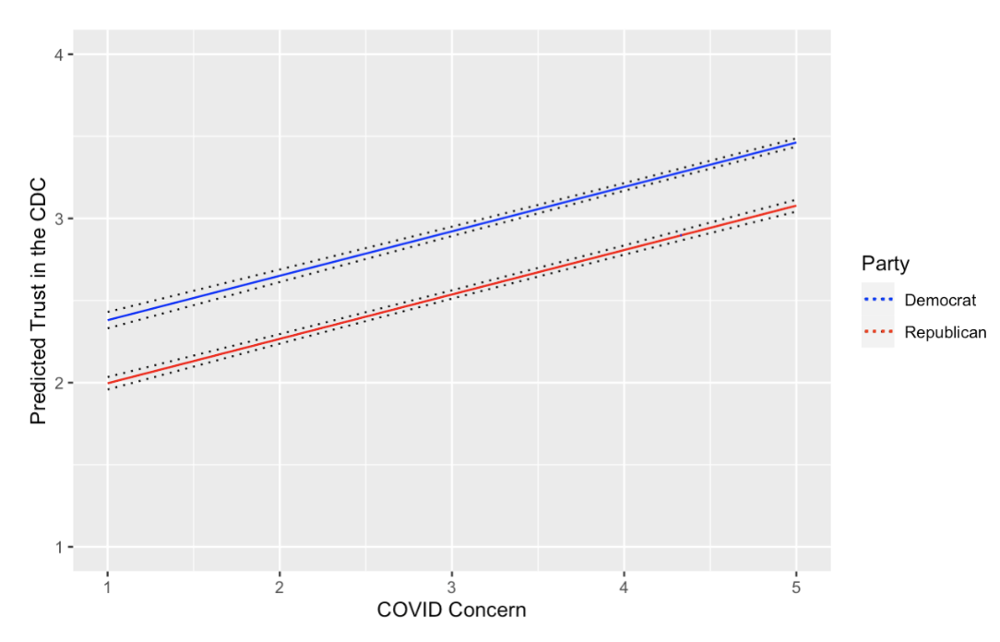

## Overview

February 2022

Note: I wrote this paper for Government 1372: Political Psychology, a
data science in the Harvard Government department. At this point, I was
gaining proficiency in R, but had not developed a sophisticated
understanding of statistics and causal inference yet. That said, this
paper was one of my first large data science projects, and was driven by
my newfound passion for applying data science techniques and programming
experience to (what I deem to be) relevant real-world problems. In Fall
2021, the pandemic was still a large public health concern, but the
public was battling a mixture of fear and desire for a return to
normalcy. I was very interested in what sources people trusted to
provide them information about the pandemic, and how that related to
their COVID anxieties – additionally, how does partisan alignment
interact with these variables?

## Abstract

Over the past two years, the coronavirus (COVID-19) pandemic has
disrupted the lives of billions of people, and has taken the lives of
millions. In that time, American citizens have reported notable levels
of concern about the pandemic (Albertson & Gadarian, 2020). Trust in
government and officials is important in times of crisis, so how does
the new spike in anxiety relate to trust? This paper analyzes the
correlative relationship between concern about the pandemic and the
trust that Americans have in their government and other important
institutions. After observing 48 weeks of panel data of N ≈ 1,000 from
the KnowledgePanel, it is revealed that there is a positive correlation
between coronavirus concern and trust in state and federal government,
as well as the CDC and national health officials. Additionally, it is
shown that there exists a non-negligible factor of partisan identity in
the determination of trust in these important information sources – an
indicator of the pandemic’s unique politicization.

## Trust in Various Institutions

Citizen trust in institutions, from health advisory bodies to different
levels of government, for relevant information is important for a
variety of reasons. During public health crises, trust in the advice of
medical experts is correlated with increased personal commitment to
safety measures that deter sickness (Goodwin et al., 2020). Increased
public trust in government allows for more ready acceptance of
containment policies, such as quarantine policies and medical testing,
during pandemics (Van Bavel et al., 2020). These COVID-19-related
insights are similar to those gathered during and after the 2014
Liberian Ebola Virus Disease epidemic: people who expressed low trust in
the government were significantly less likely to comply with
government-mandated social distancing policies, take precautions against
the virus, and support other virus control and containment policies
(Blair et al., 2017). Even away from the context of pandemics, the
relationship between institutional trust and adherence to policies
originating from or supported by that institution is rather intuitive;
previous literature has discussed the positive correlative relationship
between trust in government and law compliance (Marien & Hooghe, 2001).

Not only do attitudes about COVID-19 policy and changes in trust have
important consequences for the success of public health initiatives and
planning, but they also may have an impact on electoral politics.
Increased citizen trust in government and health advisory could
contribute to previously studied “rally-round-the-flag” effects, where
politicians gain popular support during times of national hardship
(Mueller, 1970). Decreased trust in, perhaps paired with dissatisfaction
with, government officials and their pandemic policies could sway
election results against incumbents who are usually at an advantage
otherwise – a working paper by Noland and Zhang (2021) reports that if
Donald Trump handled the pandemic about 20 percent better, or had the
pandemic not happened at all, American citizen faith would not have
decreased to a level that allowed Joseph Biden to win the 2020 election
and claim the presidency.

## Trust as an Outcome

Existing literature about trust in government, social trust, and the
effects of trust has highlighted the importance of trust in times of
crisis. In these works, trust in different institutions for important
information about relevant events has been treated as an independent
variable to assess outcomes such as compliance with public health safety
mandates, personal increased pandemic- hygiene behaviors, and impacts on
electoral politics. However, there exists much less work on what
influences citizen trust.

One such work comes from a 2010 study by Albertson and Gadarian, who
manipulated respondent anxiety to see its effects on trust as an outcome
variable. The researchers hypothesized that anxiety can increase or
decrease citizen trust in different experts, but more specifically, a
threat from an external place, far from the government’s jurisdiction,
including pandemics, was predicted to lead to increased anxiety that
lended itself to increased trust in governmental actors. As outlined in
their report on the study, this hypothesis was supported by system
justification theory (Jost, 2020), which posits that people cope with
negative events by throwing their support behind and faith in existing
systems, such as the government and institutions that are widely
recognized. At a basic level, this is reasonable, as it is expected that
anxious people would look to trusted officials for information in times
of crisis and uncertainty.

After establishing this theoretical framework, the researchers tested
their hypothesis by comparing participants’ trust in different experts
(Centers for Disease Control and Prevention, U.S. President, friends in
the medical field, and more) between the control group and the treatment
group, where respondents were treated with H1N1 (“swine flu”; influenza
A virus pandemic in 2009 and 2010) anxiety. Trust in various experts to
provide information about the H1N1 pandemic was reported on scales
ranging from “not at all” to “a great deal.” For most of the experts the
study asked respondents about, the treatment group reported more trust
than did the control group. This effect was clear for respected “expert”
federal health organizations – anxiety about the H1N1 virus led
respondents to trust the Centers for Disease Control and Prevention
(CDC) and the U.S. Department of Health and Human Services more to
provide information about H1N1. Interestingly, the treatment did not
cause significant increases in trust in public government officials like
Barack Obama, perhaps because he was not perceived to have relevant
expertise on the public health crisis despite speaking about it multiple
times.  
A decade ago, it was intuitive that anxiety about a public health crisis
would lead Americans to trust in federal health agencies to provide
relevant information about the pandemic more. But as Albertson and
Gadarian have aptly pointed out in their 2020 Washington Post analysis
of the coronavirus in the United States, COVID-19 is different from H1N1
in that it is heavily politicized and treated as a partisan issue. With
partisan divides underpinning Americans’ emotional response to pandemic
policies, the pandemic’s effects on anxiety and trust are no longer
clear nor intuitive. Do COVID-anxious people place their trust in health
experts? Does partisanship shape respondent trust in institutions and
experts more than actual anxiety?

In this research paper, I aim to analyze the correlative relationship
between anxious concern about COVID-19 and trust in different
institutions (the CDC, national health advisors, the federal government,
and the state government). I also compare this relationship to the
relationship between partisanship and the different trust responses to
determine if politicization of the pandemic has gone so far as to make
party identification more important than concern about the virus in
deciding citizens’ trust in important pandemic policymaking
institutions.

## Hypotheses

*H*1 : Concern about COVID-19 is positively correlated with
trust in all four bodies (CDC, national health advisors, federal
government, and state government).

*H*2 : Partisan identification (as Democrat or Republican)
has at least as much predictive power as COVID-19 concern in determining
respondent trust in the COVID-19 information sources.

*H*2.1 : Respondents who identify as Democrats are more
likely to trust the CDC for pandemic information than those who identify
as Republicans.

## The Axios/Ipsos Coronavirus Index

To test these hypotheses, Lucy and I used data from the Axios/Ipsos
Coronavirus Index, a weekly survey fielded from the Ipsos
KnowledgePanel. The Ipsos KnowledgePanel is a longstanding online panel
of about 60,000 United States members from diverse populations,
including racial minorities, veterans, people with disabilities,
adolescents, LGBTQ+ people, gun owners/ households, and more.
Specifically, (we) analyzed the data from respondents surveyed from
March 13, 2020 to June 28, 2021 from Axios/Ipsos Poll Waves 1 through
Wave 48, which had weekly sample sizes of about 1,000 adults.

Each week, the poll collected responses about Americans’ behaviors, risk
perceptions, attitudes about COVID-19. A few questions were of interest
to me, regarding (1) COVID-19 concern, (2) trust in the federal
government, (3) trust in the state government, (4) trust in the CDC, (5)
and trust in national public health officials. These questions were
asked as follows:

1.) “How concerned are you, if at all, about the coronavirus or COVID-19
outbreak?”

(a.) Extremely concerned

(b.) Very concerned

(c.) Somewhat concerned

(d.) Not very concerned

(e.) Not at all concerned

2.) “How much trust do you have in \[the federal government\] to provide
you with accurate information about coronavirus or COVID-19?”

(a.) A great deal

(b.) A fair amount

(c.) Not very much

(d.) None at all

3.) “How much trust do you have in \[your state government\] to provide
you with accurate information about coronavirus or COVID-19?”

Same answer options as above

4.) “How much trust do you have in \[the Centers for Disease Control, or
CDC\] to provide you with accurate information about coronavirus or
COVID-19?”

Same answer options as above

5.) “How much trust do you have in \[national public health officials\]
to provide you with accurate information about coronavirus or COVID-19?”

Same answer options as above

We also used the responses to demographic questions as control
variables, including respondent age, education level, gender, income,
and party identification.

We recoded the COVID concern, trust, and some control variables to make
them more readable, where higher values corresponded with higher
concern, trust, age, etc. For the party variable, a value of 0
corresponded with Democrats, 1 with Independents, and 2 with
Republicans.

## Methods

To test *H*1 , “Concern about COVID-19 is positively
correlated with trust in all four bodies (CDC, national health advisors,
federal government, and state government),” I ran four linear regression
models, each with one of the four trust variables as the outcome
variable and dependent variables such as COVID-19 concern, age,
education, ethnicity, gender, and party. To show the regression results,
I plotted the regression coefficients of each dependent variable for
each trust outcome variable. This analytical method and plot combination
was chosen for this hypothesis because the linear regression modelling
reveals a presence, or lack of, positive correlative relationship
between each trust outcome variable and explanatory variables such as
COVID concern. The coefficient plot visually demonstrates the
relationships between each predictor variable and respondents’ trust,
including the effect of COVID concern on trust.

To test *H*2 , “Partisan identification has at least as much
predictive power as COVID-19 concern in determining respondent trust in
the COVID-19 information sources,” I again ran the four linear
regression models. In order to compare the ability of party
identification versus COVID concern to explain the variance in trust in
different institutions and actors, I used the `scale()` function to
standardize the previously different scales of the explanatory
variables. This method is appropriate to test *H*2 because it
allows direct comparison of the regression coefficients associated with
COVID concern and party identification. Thus, the variable tied to the
larger scaled coefficient can be interpreted as the dependent variable
with more predictive power for trust in coronavirus information sources.

To test *H*2.1 , “Respondents who identify as Democrats are
more likely to trust the CDC than those who identify as Republicans,” I
plotted the predicted trust in the CDC for Democrats versus the
predicted CDC trust for Republicans using the `predict()` function. This
analytical methodology was chosen because it reveals respondents’
predicted trust in the CDC by party.

## Results

For all trust outcomes (trust in the federal government, trust in state
governments, trust in the CDC, and trust in national health officials),
changes in COVID concern, education, and party were found to have
statistically significant effects on trust. The plots below show the
regression coefficients of each predictor variable for the trust outcome
variables, with 95% confidence intervals around each coefficient
estimate.

The control variables of gender, ethnicity, and age had near-zero
coefficients in each model.  

For trust in the federal government, the regression coefficient of COVID
concern was 0.112, meaning that holding all else constant, an increase
of 1 in COVID concern (which is on a scale of 1 through 4) was
accompanied by an increase in federal government trust by 0.112 (on a
scale of 1 through 4). For the remaining regression model results, an
increase of 1 in COVID concern meant: an increase of 0.209 in state
government trust, an increase of 0.290 in CDC trust, and an increase of
0.281 in national health official trust. These results from the linear
regression models and coefficient plots support *H*1, as it
is shown that across all four measures of trust, concern about COVID-19
is positively (and statistically significantly) correlated with trust.
These results are consistent with previous research that examined the
relationship between increased anxiety about public health issues and
increased trust in health and public officials.

Figure 1 reveals that party and COVID concern have the regression
coefficients of the largest magnitude. Which is more impactful in
regards to trust? To directly compare the regression coefficients of
COVID concern and party identification as they contribute to changes in
trust, the linear regressions were run again, but this time the
aforementioned predictor variables were scaled. The previously different
scales – 1 through 4 for concern and 1 through 3 for party – are now
standardized, making the variables’ regression coefficients directly
comparable.

<figure>

<figcaption aria-hidden="true">Scaled Regression Coefficients and
Trust</figcaption>
</figure>

From Figure 2, which presents the scaled regression coefficients of
COVID concern and party alongside other control variable coefficients,
it is evident that for each trust measure, COVID concern is tied to a
larger scaled coefficient than party ID. The larger coefficient of COVID
concern indicates that when on the same scale as party identification,
COVID concern affects respondent trust in the different expert sources
more than party does. Thus, contrary to *H*2, COVID concern
actually has more predictive power than party identification in
determining respondent trust across the information sources. This
finding was rather intriguing, as it revealed the truth of a balance
that seemed could have tipped either way (towards coronavirus concern or
partisan identity); the perceived politicization of the COVID-19
pandemic in the United States made it seem plausible that partisanship
determined trust in relevant public health officials to an even larger
degree than concern about the pandemic itself. Evidently, though
partisanship had some effect on trust (as party identification had
notably large regression coefficients in relation to the trust outcome
variables), it was still trumped by the effect of concern about the
pandemic.

Further examining the non-negligible relationship between trust in
officials about COVID-19 information and partisanship reveals that
different party identification is tied to to different levels of
predicted trust in the Centers for Disease Control and Prevention.

<figure>

<figcaption aria-hidden="true">Predicted CDC Trust due to COVID Concern,
by Party</figcaption>
</figure>

Figure 3 shows the predicted level of trust in the CDC by members of
each party as COVID concern rises. Both parties appear to follow the
same trend of increased trust in the Centers for Disease Control and
Prevention as COVID concern increases in respondents, but CDC trust
begins and ends at higher values for Democrats. *H*2.1 stated
that “Respondents who identify as Democrats are more likely to trust the
CDC than those who identify as Republicans” and was supported, as
Democrats are shown to have higher predicted trust in the CDC than
Republicans across all values of COVID concern. This result is somewhat
expected, as Democrats have been more worried about containing the
coronavirus pandemic and open to the advisory of health advisory such as
the works that come from the CDC. Additionally, it is expected that
Republicans would have less comparative trust in the CDC due to Donald
Trump’s attitudes towards the organization: U.S. President from 2016 to
late 2020 and popular amongst Republicans, Trump publicly undercut the
credibility of the CDC several times, claiming the organization’s
vaccine announcements were “just incorrect information,” calling the
Director “confused,” and contradicting the advisory messages put out by
the CDC.

## Conclusion

In recent years, policymakers and health organizations worldwide have
been working to end the coronavirus pandemic that began in late 2019.
One of the important factors in this effort is citizen trust in public
health information. Thus, this paper aimed to analyze the correlative
relationship between the increased concern Americans have felt about the
pandemic and their trust in different public bodies of information,
including in the federal and state government, Centers for Disease
Control and Prevention, and national health advisers. It was
hypothesized, and confirmed, that trust was positively correlated with
concern across all four measures of trust. Furthermore, it was shown
that contrary to the second hypothesis, despite the intense
politicization of the COVID-19 pandemic, partisan identity still was not
a stronger predictor of trust than actual concern about the pandemic.
However, partisanship still had some predictive power for trust in
institutions like the CDC, with Democrat respondents being more likely
to report higher levels of trust in the CDC than Republicans, confirming
the final hypothesis.

These hypotheses were tested using linear regression models and
prediction models of data from the Axios/Ipsos Coronavirus Index. This
study can be extended and improved upon with randomized controlled
methodology, so that the causal, rather than correlative, relationship
between pandemic anxiety and trust in important information sources can
be uncovered.

This project makes contributions to the growing body of work on the
study of the COVID-19 pandemic, American behaviors in crises, the effect
of politicization, and the relationship between anxiety and political
behavior and attitudes. The pandemic has been handled by many political
actors and thus, attitudes related to pandemic policy and information
have some political charge, but individual concern about the pandemic in
regards to the wellbeing of loved ones and themselves still remains the
most significant factor in determining trust in relevant entities –
citizen trust, which was previously established to be important
emotional capital in areas ranging from pandemic containment to
electoral politics, has not been perverted by partisanship yet.

------------------------------------------------------------------------

**References**

\[1\] Albertson, & Gadarian, S. K. (2015). Anxious politics: Democratic
Citizenship in a Threatening World. Cambridge University Press.

\[2\] Albertson, B., & Gadarian, S. K. (2020, March 20). Analysis | This
is who Americans trust about coronavirus information. The Washington
Post. Retrieved from <https://www.washingtonp>
ost.com/politics/2020/03/20/were-all-anxious-about-pandemic-who-do-americans-want-hear

\[3\] Blair, R. A., Morse, B. S., & Tsai, L. L. (2017). Public health
and public trust: Survey evidence from the Ebola Virus Disease epidemic
in Liberia. Social Science & Medicine (1982), 172, 89–97.
<https://doi.org/10.1016/j.socscimed.2016.11.016>

\[4\] Goodwin, R., Wiwattanapantuwong, J., Tuicomepee, A., Suttiwan, P.,
& Watakakosol, R. (2020). Anxiety and public responses to covid-19:
Early Data from Thailand. Journal of Psychiatric Research, 129, 118–121.
<https://doi.org/10.1016/j.jpsychires.2020.06.026>

\[5\] Jost, J. T. (2020). A theory of system justification. Harvard
University Press.

\[6\] Marien, & Hooghe, M. (2011). Does political trust matter? An
empirical investigation into the relation between political trust and
support for law compliance. European Journal of Political Research,
50(2), 267–291. <https://doi.org/10.1111/j.1475-6765.2010.01930.x>

\[7\] Mueller, J. E. (1970). Presidential Popularity from Truman to
Johnson. The American Political Science Review, 64(1), 18–34.
<https://doi.org/10.2307/1955610>

\[8\] Noland, M., & Zhang, Y. E. (2021). Covid-19 and the 2020 US
presidential election: Did the pandemic cost Donald Trump reelection?
SSRN Electronic Journal. <https://doi.org/10.2139/ssrn.3807255>

\[9\] Van Bavel, Baicker, K., Boggio, P. S., Capraro, V., Cichocka, A.,
Cikara, M., Crockett, M. J., Crum, A. J., Douglas, K. M., Druckman, J.
N., Drury, J., Dube, O., Ellemers, N., Finkel, E. J., Fowler, J. H.,
Gelfand, M., Han, S., Haslam, S. A., Jetten, J., … Willer, R. (2020).
Using social and behavioural science to support COVID-19 pandemic
response. Nature Human Behaviour, 4(5), 460–471.
<https://doi.org/10.1038/s41562-020-0884-z>
