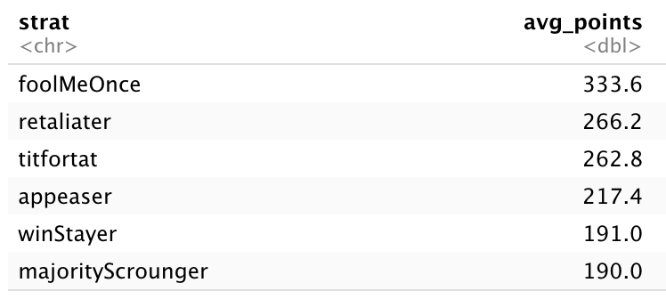
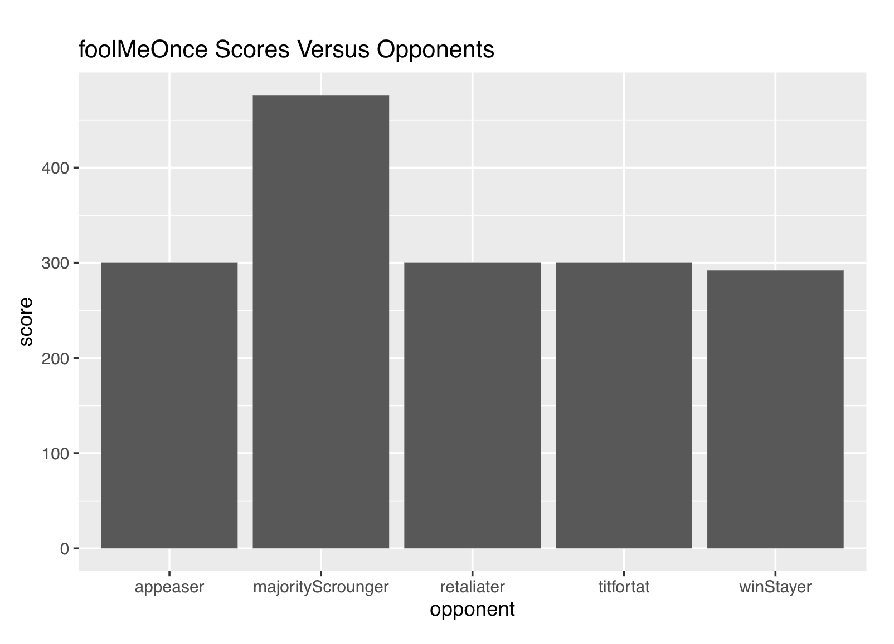
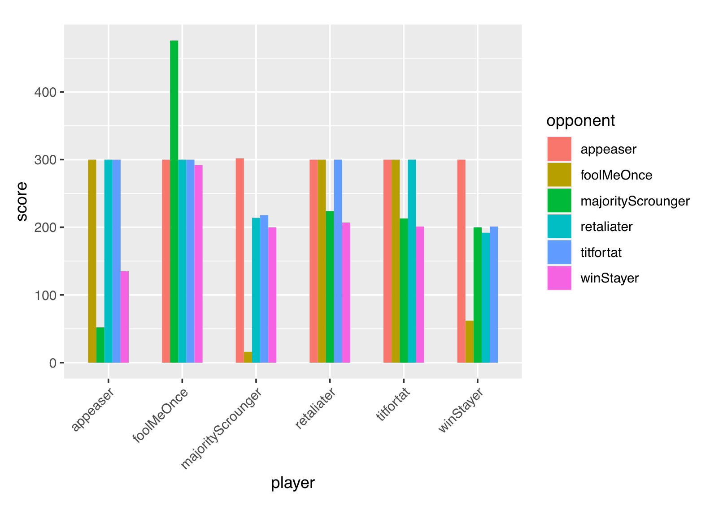

```{r setup, include=FALSE}
knitr::opts_chunk$set(echo = FALSE, include = FALSE)

library(dplyr)
library(readr)
library(ggplot2)
library(tidyverse)
library(descr)

```

# Introduction
For this week’s blog post, I look at the performance of my six selected cooperation strategies when played in a repetitive, round-robin style tournament and what the results may suggest about cooperation between humans. I select *appeaser*, *foolMeOnce*, *majorityScrounger*, *retaliater*, *titfortat*, and *winStayer* as playing strategies and set them against each other over 100 repeated rounds each.

# Data Details
*File Name: prisoners_dilemma_data.csv

*Source: Shiny app developed by [Simon Garnier](https://github.com/swarm-lab/axelRod/tree/master/R) and edited slightly by the TF team.

# Finding a Winning Strategy
I focus on two questions about the results of this tournament: how my winning strategy (according to total points) fared against its opponents, as well as how each strategy fared against all the other strategies. Which strategies were most successful against which other ones? 

My most successful strategy was *foolMeOnce*, with 2 wins in 5 games and the highest average score against its opponents – 333.6. 



It won against *majorityScrounger* and *winStayer*, and tied with *appeaser*, *retaliater*, and *titfortat*. Below is a bar chart that depicts how many points *foolMeOnce* scored against each, on average.



How did the other strategies perform overall? I created a grouped bar chart to compare their performances in their matchups. 



# Why *foolMeOnce*?
As discussed previously and is reconfirmed by the visualization of each strategy’s scoring abilities, no other chosen strategy is able to average 305+ points the same way *foolMeOnce* can. Even when a certain strategy performs particularly poorly, like appeaser (averaging 52 points) when playing *majorityScrounger*, its opponent only averages 302. The outcome of my tournament suggests that there is a uniquely dominant strategy in this tournament. So, my findings lead me to 2 new questions: why does *foolMeOnce* perform so well in this tournament? How does it achieve point average heights that other strategies cannot?

To investigate these questions, let’s first solidify our understanding of how *foolMeOnce works*. Its description is as follows: 

1. Cooperates the first time it plays a new opponent.  
2. Keeps cooperating after the first defection of the opponent. 
3. Defects systematically after the opponent defects a second time.
Therefore, the strategy says: cooperate until opponent’s second defection, then only defect after that. 

This strategy reminds me of the Grim Trigger (GT) strategy, which entails cooperation until the opponent defects once. After that, GT players systematically defect. The rationale for this strategy is that one can only trust their opponent until the opponent betrays their cooperative deal. After a player has been forced to take the sucker prize once, they should never trust the opponent to cooperate again. Thus, they themselves should never cooperate again in order to avoid the sucker prize. In practice, Grim Trigger is a bit too unforgiving. Researchers Miguel Aramendia, L. Ruiz, and Federico Valenciano recognized this in their paper, “The Forgiving Trigger Strategy: An Alternative To The Trigger Strategy,” where they note that “It is possible to improve on the grim-trigger strategy while retaining subgame perfection and in some cases adding weak renegotiation proofness… The basic idea is that, following a deviation, the cheater, instead of continuing in the Nash equilibrium forever, chooses an autopenalty which signals, in a very strong way, that he/she would not deviate any more if cooperation were reestablished.”

This improved Grim Trigger strategy from the Aramendia-Ruiz-Valenciano paper, which signals that cooperation is possible again if one’s opponent stops defecting after the first time, is essentially what *foolMeOnce* does as a strategy. Even after the first defection, *foolMeOnce* players allow for the possibility of future mutual cooperation, which is a better choice for both players compared to mutual, continuous defection. It is only after the second opponent defection, a repeated betrayal of trust, that *foolMeOnce* players finally pull the trigger and defect systematically to avoid future sucker prizes. 

After investigating *foolMeOnce* further, I understand why it is highly effective. Like *titfortat*, a strategy that Axelrod pinpoints as sure-fire, *foolMeOnce* starts with the spirit of cooperation. It continues to cooperate so long as the opponent cooperates. Upon first defection, *titfortat* reactively retaliates while *foolMeOnce* forgives and continues to cooperate. However, after the second defection, *titfortat* still allows the opponent to continue making marginal gains in points should they choose to defect again in the future. In contrast, *foolMeOnce* disallows these comparative point gains to continue occurring after the second defection: from that point on, both players will take the mutual defection prize, or *foolMeOnce* players will claim the temptation prize alone. Effectively, *foolMeOnce* players can only do better, or equally as poorly, as their opponents – but never worse. In a tournament and analysis where comparative performance matters, such a strategy comes out on top. 

This insight into cooperation/defection strategy may be extended into the political realm. When actors come into repeated contact, should they follow a Grim Trigger, *titfortat*, *foolMeOnce*, or some other logic? Of course, actors will not behave like perfect computer players, but their philosophies about cooperation and retaliation are relevant. Because a strategy like Grim Trigger is so unforgiving, it can be inefficient in real applications. For example, two nations trying to cooperate will lose all chances to work together once either side defects, even if it was a truly singular occurrence. For significant issues requiring cooperation, like nuclear disarmament or climate change, abrupt and total shutdown of cooperation would be unfavorable for such important end goals. The outcome of my data analysis for this week has suggested to me that perhaps a discipline-heavy strategy like GT would work, but with more forgiveness built-in. Thus, whether defection is limited to 2 occurrences like with *foolMeOnce*, or collaborating countries incorporate efficient breach terms into their transactions, I believe that the formula of serious punishment of defection and prioritization of cooperation can incentivize cooperation between important actors in the political world.

---

**References**

[1] Axelrod (1980)

[2] Miguel Aramendia, L. Ruiz, and Federico Valenciano (2004)
