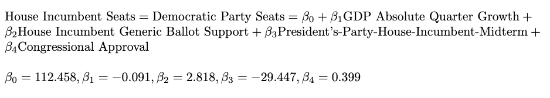

```{r setup, include = FALSE, message = FALSE}
# # Set up
knitr::opts_chunk$set(echo = TRUE)
library(tidyverse)
library(ggplot2)
library(janitor)
library(readr)
library(stargazer)
library(usmap)
library(rmapshaper)
library(sf)
library(insight)
library(scales)
library(packcircles)

# 
expert_ratings <- read_csv("expert_rating.csv")
historical_results <- read_csv("historical_results.csv")
# df <- read_csv("econ_mid_genball_results.csv")
d2022 <- read_csv("house_cands.csv")
cook <- read_csv("cook.csv")
inside <- read_csv("inside_elections.csv")

nat_model_data <- read_csv("nat_model_data.csv")
poll_df <- read_csv("538_generic_ballot_averages_2018-2022.csv")
```

# Overview
Welcome to the final election forecasting update of this election cycle! It's been a long journey of election research and data analysis, but alas, we are one day out from Election Day. In today's blog post, I am going to present my final predictions in detail, which will involve model formulas, model descriptions, model coefficients, model interpretations, model validation, prediction confidence intervals, and visualizations for my national and district-level models. 

```{r echo = FALSE, out.width = "95%", fig.cap = 'Source: The Economist.'}
knitr::include_graphics("election.png")
```
# National Model
Starting in [week 2](https://vivian-1372.github.io/Election-Analytics/post/2022-09-19-local-and-national-economy/), I wanted to build out a good national model with a mix of fundamental variables to predict the national two-party vote shares of the parties. I ultimately chose to stick with fundamentals because in [weeks 5](https://vivian-1372.github.io/Election-Analytics/post/2022-10-10-the-air-war/) and [6](https://vivian-1372.github.io/Election-Analytics/post/2022-10-19-the-ground-game/), I found that campaign activity, whether it be on air or on the ground, didn't significantly or directly impact electoral outcomes. In [week 7](https://vivian-1372.github.io/Election-Analytics/post/2022-10-24-shocks/), I reached the same conclusion regarding shocks during the election cycle. 

The best iteration of my model is the most recent one, which includes only 4 predictors: absolute GDP growth (Quarter 8, the last of the election cycle), the average generic ballot support of the House incumbent party (weighted by recency of the poll), an indicator for whether or not the House incumbent party is also the president's party during a midterm year, and the average congressional approval rate. Absolute GDP growth is the economic variable I chose to capture how voters reward and punish the incumbent House party, and it came about after multiple considerations of other economic variables like unemployment rate, GDP growth percentage, and RDI change percentage. Average generic ballot support of the party in control of the House, introduced in [week 3](https://vivian-1372.github.io/Election-Analytics/post/2022-09-26-polls-and-pollsters/), reflects how much the nation wants the currently-leading party to retain that congressional power. The binary indicator for `President's-Party-House-Incumbent-Midterm` is my attempt to capture the well-known fact that the president's party consistently performs poorly in midterm elections, which I covered in [week 1](https://vivian-1372.github.io/Election-Analytics/post/2022-09-15-analzying-2020-house-vote-shares/). The indicator is equal to 1 if the party in control of the House happens to be the president's party in a midterm year, and to 0 otherwise. Lastly, the average congressional approval rate was included because I believe it gives us a sense of how satisfied voters are with Congress, generally. This is distinct from the generic ballot support metric, with the former telling us how much voters like Congress's performance, which (perhaps unintuitively) doesn't match 1-to-1 with how much voters want the incumbent party to stay in power.

```{r congressional approval vs. generic ballot, include = FALSE}
plot(nat_model_data$year[17:37], nat_model_data$cong_approv[17:37], type = 'l', main = "Congressional Approval and Generic Ballot Support over the Years", xlab = "Year", ylab = "Percentage", col = "orange")
lines(nat_model_data$year, nat_model_data$pp_generic_ballot, col = "purple")
legend(1979, 23, legend = c("Congressional Approval", "Generic Ballot"), col = c("orange", "purple"), lty = 1:1)
```

```{r echo = FALSE, out.width = "75%", fig.cap = 'Disconnect between Congressional Approval and Incumbent Generic Ballot.'}
knitr::include_graphics("CA_GB.png")
```
As shown above, generic ballot support for the incumbent party in the House doesn't move with general approval of Congress! This was surprising to me at first, but was a good sign that I wasn't introducing too much collinearity into my model by including both measures.   

## Model Details

### Vote Share Formula
I wanted to use this model to predict both national incumbent two-party vote share and national incumbent seat count, so I came up with two final regression formulas that incorporated the aforementioned fundamental predictors.  


### Vote Share Regression
In modeling the incumbent party's two-party vote share, which is the Democrat's vote share this election, we get some interesting coefficients. See below for this model's coefficient values, variable significance, and the model's overall evaluation metrics (like R-squared and adjusted R-squared).

```{r echo = FALSE, out.width= "75%", fig.cap = 'National Democratic Two-Party Vote Share Regression Output.'}
knitr::include_graphics("nat_VS_reg.png")
```

The small, but negative, coefficient attached to absolute GDP is rather unintuitive, but my hypothesis is that for GDP, voters respond to levels and relative change differently. Previous weeks' work has shown that positive percentage change is associated with higher incumbent vote share, as we'd expect, but positive absolute change is negatively correlated with incumbent party vote share perhaps because voters slightly punish incumbents when they deem the absolute change is not "large enough." For every additional billion dollars of GDP change between the 7th and 8th quarters, the incumbent party loses 0.014 percentage points. 

The generic ballot support variable has a coefficient of 0.472, which makes sense - if voters generally support the incumbent party in polls, the party can expect to do well on Election Day. For every percentage point higher the generic ballot support is for the incumbent party in polls, the incumbent party earns an additional 0.472 percentage point of vote share. 

The only variable with a larger coefficient than generic ballot support is the president's-party-incumbent-midterm variable. Midterm years in which the incumbent party is the president's party see the incumbent party losing 2.788 percentage points of vote share. This is consistent with the decades of poor president's party House performance we've observed. 

Lastly, with every 1 percentage point increase in congressional approval, the incumbent party gains 0.092 percentage points in vote share. Again, this makes sense, as more voter satisfaction with the current Congress should be correlated with higher electoral support for the House incumbent party to remain in power. 

I would like to quickly note my model's final adjusted R-squared, 0.872, which is a nice improvement from [week 2's](https://vivian-1372.github.io/Election-Analytics/post/2022-09-19-local-and-national-economy/) 0.292. This value indicates that the model, with its 4 predictors, can explain about 87.2% of the variance in incumbent party vote share. 

### Vote Share Validation
```{r vote share validation, include = FALSE}
nat_model_data <- nat_model_data %>%
  filter(year >= 1980)
outsamp_errors <- sapply(1:1000, function(i){
  years_outsamp <- sample(nat_model_data$year, 8)
  outsamp_mod <- lm(H_incumbent_party_majorvote_pct ~ GDP_growth_qt + 
               pp_generic_ballot + midterm_pres_party_inc_party + cong_approv, nat_model_data[!(nat_model_data$year %in% years_outsamp),])
  outsamp_pred <- predict(outsamp_mod, newdata = nat_model_data[nat_model_data$year %in% years_outsamp,])
  outsamp_true <- nat_model_data$H_incumbent_party_majorvote_pct[nat_model_data$year %in% years_outsamp]
  mean(outsamp_pred - outsamp_true)
})
 
hist(outsamp_errors, breaks = 20,
     xlab = "",
     main = "Mean Out-of-Sample Residual for\n Vote Share Model (1000 runs of CV)")
```


```{r vote share validation printout, echo = FALSE, fig.cap = 'National Democratic Two-Party Vote Share Model Validation.'}
knitr::include_graphics("nat_VS_val.png")
```

Above is the histogram of the mean out-of-sample residuals over 1,000 runs of cross-validation for my model. The distribution looks roughly normally distributed, with a mean a little below 0, tiny tails, and most residuals within [-2, 2].  

### Seat Count Formula
Next, I ran the same model again, but this time with incumbent party seat count as the response variable. Below are the regression formula and regression output for this model.


### Seat Count Regression
```{r echo = FALSE, out.width= "75%",  fig.cap = 'National Democratic Seat Count Regression Output.'}
knitr::include_graphics("nat_S_reg.png")
```

The model coefficients of the seat count model have the same signs as those of the vote share model, but different magnitudes because of the switch from predicting vote share, which can only be in the interval [0, 100], to predicting seat count, which can be [0, 435]. It is really the sign of the coefficients that matter for interpretation, and since those haven't changed, I will only briefly comment on this regression output. 

It's helpful to see the relationship between the president's-party-incumbent-midterm effect and *seat count* because now, it becomes clear that when the president's party is trying to defend its House incumbency in midterm years, like this year, it faces a steep uphill battle - when the indicator variable is 1, and everything else is held constant, the incumbent party is predicted to lose around 29 seats. 

### Seat Count Validation
```{r seat count validation, include = FALSE}
nat_model_data <- nat_model_data %>%
  filter(year >= 1980)
outsamp_errors <- sapply(1:1000, function(i){
  years_outsamp <- sample(nat_model_data$year, 8)
  outsamp_mod <- lm(seats ~ GDP_growth_qt + 
               pp_generic_ballot + midterm_pres_party_inc_party + cong_approv, nat_model_data[!(nat_model_data$year %in% years_outsamp),])
  outsamp_pred <- predict(outsamp_mod, newdata = nat_model_data[nat_model_data$year %in% years_outsamp,])
  outsamp_true <- nat_model_data$seats[nat_model_data$year %in% years_outsamp]
  mean(outsamp_pred - outsamp_true)
})
 
hist(outsamp_errors, breaks = 20,
     xlab = "",
     main = "Mean Out-of-Sample Residual for\n Seat Count Model (1000 runs of CV)")
```

```{r seat count validation printout, echo = FALSE, out.width= "75%", fig.cap = 'National Democratic Party Seat Count Model Validation.'}
knitr::include_graphics("nat_S_val.png")
```

Above is the histogram of the mean out-of-sample residuals over 1,000 runs of cross-validation for my model again, this time for prediction of incumbent seat count. The distribution looks roughly normally distributed, with a mean at around 0 and most residuals within [-20, 20]. Neither our vote share nor our seat count model seem to perform poorly when tested with out-of-sample data, so we may move forward with prediction now!  

## National Predictions
Using the two models above, and the newest data for the 2022 midterms, I predict that the House incumbent (Democratic Party) two-party vote share will be **48.56%** (47.36, 49.83) and the seat count will be **209** (198, 221).

The GDP data comes from [FRED](https://fred.stlouisfed.org/series/GDPC1), the generic ballot data comes from [FiveThirtyEight](https://projects.fivethirtyeight.com/polls/generic-ballot/), and the congressional approval numbers come from [Gallup](https://news.gallup.com/poll/1600/congress-public.aspx).
```{r visualization, echo = FALSE, fig.cap= '435 Seats Up For Grabs.'}
knitr::include_graphics("nat_model_viz.png")
```

# District Models
Since [week 4](https://vivian-1372.github.io/Election-Analytics/post/2022-10-03-incumbency/), I have been slowly working towards building 435 models for the 435 district races. After much consideration, I decided to build two types of models: (1) the competitive type, which involves the average of many expert predictions and incumbency, and (2) the non-competitive type, which involves past election results and incumbency.

Most expert ratings were pulled from Wikipedia's election ratings pages for each election (see this year's page [here](https://en.wikipedia.org/wiki/2022_United_States_House_of_Representatives_election_ratings)), and districts are determined to be competitive if one of the major rating groups considered them not "safe" or "solid". 

## Model Details
```{r competitive district models with incumbency and expert rating, include = FALSE, message = FALSE}
expert_ratings$district <- as.numeric(expert_ratings$district)
historical_results$district <- as.numeric(historical_results$district)

avg_ratings <- expert_ratings %>% 
  select(year, state, district, avg_rating)

historical_results <- historical_results %>% 
  mutate(incumbent = case_when(DemStatus == "Incumbent" ~ 1, T ~ 0), demWin = case_when(WinnerParty == "D" ~ 1, T ~ 0), open = case_when((DemStatus == "Challenger" & RepStatus == "Challenger") ~ 1, T ~ 0))

train_data <- avg_ratings %>% 
  filter(year != 2022) %>% 
  left_join(historical_results, by = c("year", "state", "district"))  %>%
  group_by(state, district) %>% 
  filter(n() > 1) %>% 
  group_nest() %>% 
  mutate(data = map(data, ~unnest(., cols = c())))

d2022$district <- as.numeric(d2022$district )
d2022 <- d2022 %>%
  filter(cand_party == "Democratic") %>%
  distinct()

test_data <- avg_ratings %>% 
  left_join(d2022, by = c("state", "district")) %>%
  filter(year == 2022) %>% 
  group_by(state, district) %>% 
  group_nest() %>% 
  mutate(data = map(data, ~unnest(., cols = c())))

models <- train_data %>% 
  mutate(model = map(data, ~lm(dem_votes_major_percent ~ avg_rating + incumbent, 
                                  data = .x))) %>% 
  select(-data)

model_results <- models %>% 
  mutate(RS = map_dbl(model, ~summary(.x)$r.squared), ARS = map_dbl(model, ~summary(.x)$adj.r.squared))

pred_C_2022 <- test_data %>%
  # inner join as there may not be historical models for some districts
  inner_join(models, by = c("state", "district")) %>% mutate(preds = map(.x = model, .y = data, ~predict(object = .x, newdata = as.data.frame(.y),
                                                        se.fit = TRUE,
                                                        type = "response")),
         lower = map(.x = preds, ~.x$fit - (2 * .x$se.fit)),
         fitted = map(.x = preds, ~.x$fit),
         upper = map(.x = preds, ~.x$fit + (2 * .x$se.fit)))

preds_C_2022 <- pred_C_2022 %>%
  unnest(cols = c(fitted, lower, upper)) %>%
  distinct() %>%
  mutate(winner = case_when(fitted >= 50 ~ "Democrat", T ~ "Republican")) %>%
  select(state, district, fitted, lower, upper, winner)

hist(model_results$RS)
mean(model_results$RS, na.rm = TRUE)
mean(model_results$ARS, na.rm = TRUE)
length(model_results)
```

```{r non-competitive district models with incumbency and past results, include = FALSE, message = FALSE}
HR <- historical_results %>%
  filter(!is.infinite(vote_margin)) %>%
  mutate(incumbent = case_when(DemStatus == "Incumbent" ~ 1, T ~ 0), demWin = case_when(WinnerParty == "D" ~ 1, T ~ 0), open = case_when((DemStatus == "Challenger" & RepStatus == "Challenger") ~ 1, T ~ 0)) %>%
  group_by(district_id) %>%
  mutate(wm = dem_votes_major_percent - rep_votes_major_percent) %>%
  summarize(dem_votes_major_percent = dem_votes_major_percent, vote_margin = vote_margin, year = year, state = state, district = district, incumbent = incumbent, wm = wm) %>%
  mutate(last_dem_VS = lead(dem_votes_major_percent), last_VM = lead(vote_margin), last_WM = lead(wm)) %>%
  filter(is.na(last_dem_VS) != TRUE, is.na(last_WM)!=TRUE) %>% 
  ungroup()

expert_ratings$district <- as.numeric(expert_ratings$district)
historical_results$district <- as.numeric(historical_results$district)
HR$district <- as.numeric(HR$district)
d2022$district <- as.numeric(d2022$district)

data2022 <- d2022 %>% filter(cand_party == "Democratic") %>%
  left_join(HR %>% filter(year == 2020) %>% select(-incumbent, -year), by = c("state", "district")) %>%
  distinct() %>%
  group_by(state, district) %>%
  mutate(last_dem_VS = dem_votes_major_percent, last_VM = vote_margin, last_WM = wm)

data2022$district_id[227] = "MT01"
data2022$district_id[228] = "MT02" 
data2022$district_id[83] = "CO08"
data2022$district_id[114] = "FL28"
data2022$district_id[292] = "NC14"
data2022$district_id[318] = "OR06" 
data2022$district_id[380] = "TX37"
data2022$district_id[381] ="TX38"
data2022$district[386] = "0"
data2022$district[89] = "0"
data2022$district[6] = "0"
data2022$district[416] = "0"

sds = unique(data2022$district_id)
models <- list()
r2 <- c()
ar2 <- c()
fitted <- c()
lower <- c()
upper <- c()
coef_incumb <- c()
coef_last_dem_VS <- c()
labs <- c()

for (sd in sds){
  temp <- HR %>%
    filter(district_id == sd)
  new_data <- data2022 %>%
    filter(district_id == sd) 

  if (nrow(temp) > 0)
  {
    m <- lm(dem_votes_major_percent ~ last_dem_VS + incumbent, data = temp)
    models[[length(models)+1]] <- m

    r2 <- c(r2, summary(m)$r.squared)
    ar2 <- c(ar2, summary(m)$adj.r.squared)
    
    fitted <- c(fitted, as.numeric(predict(m, new_data, interval = 'confidence')[1]))
    lower <- c(lower, as.numeric(predict(m, new_data, interval = 'confidence')[2]))
    upper <- c(upper, as.numeric(predict(m, new_data, interval = 'confidence')[3]))

    coef_incumb <- c(coef_incumb, as.numeric(m$coefficients[3]))
    coef_last_dem_VS <- c(coef_last_dem_VS, as.numeric(m$coefficients[2]))
    labs <- c(labs, sd)
  }
}

mean(ar2, na.rm = TRUE)

state_abb = c()
state = c()
district = c()

for (lab in 0:length(labs)){
  state_abb <- c(state_abb, substr(labs[lab], 0, 2))
  district <- c(district, as.numeric(substr(labs[lab], 3, 4)))
}

for (state_ab in 1:length(state_abb)){
  state <- c(state, state.name[grep(state_abb[state_ab], state.abb)])
}

preds_NC_2022 <- data.frame(cbind(state, district, fitted, lower, upper))
preds_NC_2022 <- preds_NC_2022 %>%
  mutate(winner = case_when(fitted >= 50 ~ "Democrat", T~"Republican"))
```

```{r non-competitive models remove, include = FALSE}
# # 4 = Currently Safe/Solid D, 3 = D Favored/Likely D, 2 = Lean D, 1 = Toss-up/Tilt D, 0 = Pure Toss-Up, 
# # -4 = Currently Safe/Solid R, -3 = R Favored/Likely R, -2 = Lean R, -1 = Toss-up/Tilt R 
# # comp_states <- pred_2022 %>%
# #   select(state, district)
# # 
# all <- left_join(cook, inside %>% select(-c(...1, inc_party, is_open, geoid)) %>% rename('IE' = 'code'), by = c("year", "state", "district")) %>%
#   select(year, state, district, inc_party, geoid, code, IE) %>%
#   rename(cook = code) %>%
#   mutate(avg_rating = (cook + IE) / 2)
# 
# historical_results <- historical_results %>%
#   mutate(incumbent = case_when(DemStatus == "Incumbent" ~ 1, T ~ 0), open = case_when(DemStatus == "Challenger" & RepStatus == "Challenger" ~ 1, T ~ 0))
# 
# all$state_new = ""
# for (thing in 1:nrow(all))
# {
#   all$state_new[thing] = state.name[grep(all$state[thing], state.abb)]
# }
# 
# all <- all %>%
#   select(-state) %>%
#   rename(state = state_new)
# 
# all$district <- as.numeric(all$district)
# historical_results$district <- as.numeric(historical_results$district)
# 
# 
# train_data <- all %>%
#   filter(year != 2022) %>%
#   # left join as there aren't ratings for every district
#   left_join(historical_results, by = c("year", "state", "district"))  %>%
#   group_by(state, district) %>%
#     drop_na(dem_votes_major_percent, IE) %>%
#   filter(n() > 1) %>% # Filtering out single data rows
#   group_nest() %>%
# 
#   mutate(data = map(data, ~unnest(., cols = c())))
# 
# d2022$district <- as.numeric(d2022$district )
# d2022 <- d2022 %>%
#   filter(cand_party == "Democratic") %>%
#   distinct()
# 
# test_data <- all %>%
#   left_join(d2022, by = c("state", "district")) %>%
#   filter(year == 2022) %>%
#   group_by(state, district) %>%
#   group_nest() %>%
#   mutate(data = map(data, ~unnest(., cols = c())))
# 
# 
# train_data %>%
#   unnest()
# # Building TERRIBLE models
# models <- train_data %>%
#   mutate(model = map(data, ~lm(vote_margin ~ incumbent + avg_rating,
#                                   data = .x))) %>%
#   select(-data)
# 
# # Extracting TERRIBLE model results
# model_results <- models %>%
#   mutate(RS = map_dbl(model, ~summary(.x)$r.squared), ARS = map_dbl(model, ~summary(.x)$adj.r.squared))
# 
# # # Predicting 2022 with a TERRIBLE model
# # pred_2022 <- test_data %>%
# #   # inner join as there may not be historical models for some districts
# #   inner_join(models, by = c("state", "district")) %>%
# #   mutate(pred = map(.x = model, .y = data, ~predict(object = .x, newdata = as.data.frame(.y), interval = 'confidence'))) %>%
# #   select(state, district, pred)
# 
# pred_2022 <- test_data %>%
#   # inner join as there may not be historical models for some districts
#   inner_join(models, by = c("state", "district")) %>% mutate(preds = map(.x = model, .y = data, ~predict(object = .x, newdata = as.data.frame(.y),
#                                                         se.fit = TRUE,
#                                                         type = "response")),
#          lower = map(.x = preds, ~.x$fit - (2 * .x$se.fit)),
#          fitted = map(.x = preds, ~.x$fit),
#          upper = map(.x = preds, ~.x$fit + (2 * .x$se.fit)))
# 
# 
# 
# 
# # join above with just all the states and their sd_fips; then loop through the remaining 341 to make their predictions using incumbency + rating; if open seat, then rating only?
# 
# historical_results %>%
#   filter(state == "AK")
# 
# train_data %>%
#   unnest(cols = c(data)) %>%
#   group_by(is.na(dem_votes_major_percent)) %>%
#   summarize(c = n())
# 
# preds2 <- pred_2022 %>%
#   unnest(cols = c(fitted, lower, upper)) %>%
#   distinct() %>%
#     mutate(winner = case_when(fitted >= 0 ~ "Republican", T ~ "Democrat")) 
#   mutate(winner = case_when(fitted >= 50 ~ "Democrat", T ~ "Republican")) %>%
#   select(state, district, fitted, lower, upper, winner)
# 
# preds
# preds2
# 
```
The main difference in variable selection between the competitive and non-competitive models boils down to the fact that naturally, there is a lot more coverage of the competitive ones, meaning more expert rating availability. Because of this, the competitive district models feature an average of about 7 expert ratings, whereas the non-competitive ones feature none. 

For the competitive districts, I used the following regression formula:

These models ended up with an average R-squared of 0.88 and average adjusted R-squared of 0.49. 

Developing models for the non-competitive models was a journey - over the weeks, I realized that good district-level data is hard to come by, and with Election Day drawing near, I felt there was a choice between building out a self-made model and building a highly predictive one to be made. In the end, I decided to go with the former, in the name of learning. The models then are fundamentals-based than the competitive ones, using the major vote share of the last Democrat candidate in addition to the incumbency of the current candidate.  


I chose to use these variables because House elections have historically favored incumbent candidates, and I believe that how the Democrat performed in each district in previous years can tell us a lot about how the Democratic candidate will perform this year.


The histogram above illustrates the coefficient values for the incumbent variable over the many non-competitive districts. The average coefficient value is a little under 16, and it indicates that on average, when a Democratic candidate is an incumbent, their vote share is expected to be about 16 points higher than had they not been an incumbent. This definitely tracks with what we know about the incumbency advantage for House members.


This histogram shows the coefficient values for the last Democrat's vote share (in the previous election), and the mean is value is 0.36. The numerical interpretation of this one is a little confusing, but the main takeaway is that the vast majority of these coefficients are positive, indicating that the higher the last Democrat's vote share, the higher we can expect this year's Democratic vote share to be. 

These models have an average R-squared of 0.50 and average adjusted R-squared of 0.45. 

## District Predictions
Below are my predictions for the 94 most competitive districts, using expert ratings and incumbency:
```{r, echo = FALSE}

export_table(preds_C_2022, format = 'html')
# write_csv(preds_C_2022, "preds_C.csv")
# write_csv(preds_NC_2022, "preds_NC.csv")

```

And the non-competitive district predictions, using past election results and incumbency:
```{r district model viz, echo = FALSE, fig.cap = 'Note: Visualization of District-Level Predictions; Several Districts Mapped Imperfectly.'}
knitr::include_graphics('dist_viz.png')
```
Both my national and district-level work has indicated that the Republicans are likely to win the House back once the votes have all been counted. We will see soon if these predictions are correct, and precisely how correct or incorrect they were. Below you can find the rest of the district predictions, complete with 95% confidence intervals. 

It's been a great 8 weeks, see you on the other side of the 2022 midterms!
```{r, echo = FALSE}

export_table(preds_NC_2022, format = 'html')

```

```{r district models for non-competitive ones bad ; just use incumbent?, include = FALSE}

# ## use expert ratings and incumbency for all 435, see if it agrees with my all expert preds + incumb model for the competitive ones. 
# # 
# #### THis is broken rn, with 0.08 r-squared, but it DOES incorporate "all" data so that we acn pull expert predictions... so something to consider fixing. or just stick with model up there, which is fine already
# 
# HR <- historical_results %>%
#   filter(!is.infinite(vote_margin)) %>%
#   mutate(incumbent = case_when(DemStatus == "Incumbent" ~ 1, T ~ 0), demWin = case_when(WinnerParty == "D" ~ 1, T ~ 0), open = case_when((DemStatus == "Challenger" & RepStatus == "Challenger") ~ 1, T ~ 0)) %>%
#   group_by(district_id) %>%
#   summarize(dem_votes_major_percent = dem_votes_major_percent, vote_margin = vote_margin, year = year, state = state, district = district, incumbent = incumbent) %>%
#   mutate(last_dem_VS = lead(dem_votes_major_percent), last_VM = lead(vote_margin)) %>%
#   drop_na(district_id) %>%
#   filter(is.na(last_dem_VS) != TRUE) %>% 
#   ungroup()
# 
# expert_ratings$district <- as.numeric(expert_ratings$district)
# historical_results$district <- as.numeric(historical_results$district)
# HR$district <- as.numeric(HR$district)
# d2022$district <- as.numeric(d2022$district)
# all$district <- as.numeric(all$district)
# 
# 
# newdf <- left_join(all, HR, by = c("year", "state", "district"))
# 
# # data2022 <- all %>%
# #   filter(year == 2022) %>%
# #   left_join(d2022 %>% filter(cand_party == "Democratic"), by = c("state", "district")) %>%
# #   left_join(HR %>% filter(year == 2020) %>% select(-incumbent, -year), by = c("state", "district")) %>%
# #   distinct() %>%
# #   group_by(state, district) %>%
# #   mutate(last_dem_VS = dem_votes_major_percent, last_VM = vote_margin)
# 
# 
# data2022 <- d2022 %>% filter(cand_party == "Democratic") %>%
#   left_join(HR %>% filter(year == 2020) %>% select(-incumbent, -year), by = c("state", "district")) %>%
#   distinct() %>%
#   group_by(state, district) %>%
#   mutate(last_dem_VS = dem_votes_major_percent, last_VM = vote_margin)
# 
# data2022$district_id[227] = "MT01"
# data2022$district_id[228] = "MT02" 
# data2022$district_id[83] = "CO08"
# data2022$district_id[114] = "FL28"
# data2022$district_id[292] = "NC14"
# data2022$district_id[318] = "OR06" 
# data2022$district_id[380] = "TX37"
# data2022$district_id[381] ="TX38"
# 
# 
# 
# sds = unique(data2022$district_id)
# unique(newdf$district_id)
# 
# models <- list()
# r2 <- c()
# ar2 <- c()
# preds <- c()
# labs <- c()
# for (sd in sds){
#   temp <- newdf %>%
#     filter(district_id == sd)
#   new_data <- data2022 %>%
#     filter(district_id == sd) 
# 
#   if (nrow(temp) > 0)
#   {
#     m <- lm(dem_votes_major_percent ~ incumbent + last_dem_VS + last_VM, data = temp)
#     models[[length(models)+1]] <- m
# 
#     r2 <- c(r2, summary(m)$r.squared)
#     ar2 <- c(ar2, summary(m)$adj.r.squared)
#     
#     preds <- c(preds, as.numeric(predict(m, new_data)[1]))
#     labs <- c(labs, sd)
#   }
# }
# 
# hist(ar2)
# mean(ar2, na.rm = TRUE)
# 
# cbind(sds, preds)

```


```{r district model visualization, include = FALSE, results='hide',fig.keep='all', message=FALSE}

# 
# cd114 <- st_read("districts114.shp")
# # =======
# # cd114 <- get_congress_map(114)
# # >>>>>>> 1b982eea6f0ad653c5f59e4ecc0201948c3d7c00
# # 
# # vote data
# h <- preds_NC_2022 %>%
#   rename(district_id = labs)
# 
# preds_viz <- HR %>%
#   group_by(district_id, state, district) %>%
#   summarize(state = state, district= district) %>%
#   distinct() %>%
#   inner_join(h, by = "district_id")
# 
# R_2014 <- preds_viz %>%  
#   select(state, district, fitted) %>%
#   # summarize party vote share by district
#   group_by(state, district) %>%
#   summarise(Dem_votes_pct = as.numeric(fitted)) %>%
#   # rename district variable name to match shapefile
#   rename(DISTRICT = district, STATENAME = state) %>% drop_na()
# 
# cd114$DISTRICT
# cd114$STATENAME
# # merge
# cd114$DISTRICT <- as.numeric(cd114$DISTRICT)
# R_2014$DISTRICT <- as.numeric(R_2014$DISTRICT)
# cd114 <- cd114 %>% left_join(R_2014, by=c("DISTRICT", "STATENAME"))
# head(cd114$Dem_votes_pct)
# 
# # plot with simplify
# districts_simp <- rmapshaper::ms_simplify(cd114, keep = 0.01)
# 
# ggplot() + 
#   geom_sf(data=districts_simp,aes(fill=Dem_votes_pct),
#           inherit.aes=FALSE,alpha=0.9) + 
#   scale_fill_gradient2(low = "red", high = "blue", midpoint = 50, limits=c(0,100), name = "Democrat Major Vote Share") +
#   coord_sf(xlim = c(-172.27, -66.57), ylim = c(18.55, 71.23), expand = FALSE) +  
#   theme_void() +
#   theme(axis.title.x=element_blank(),
#         axis.text.x=element_blank(),
#         axis.ticks.x=element_blank(),
#         axis.title.y=element_blank(),
#         axis.text.y=element_blank(),
#         axis.ticks.y=element_blank()) + ggtitle("2022 Midterm Predictions") 
# 
# pred_NC_2022 <- h %>%
#  # rename(district_id = "labs") %>%
#   full_join(HR, by = "district_id") %>%
#   group_by(district_id) %>%
#   select(district_id, state, district, fitted, lower, upper) %>%
#   summarize(state = state)

```


---
**References**

[1] U.S. Bureau of Economic Analysis, Real Gross Domestic Product [GDPC1], retrieved from FRED, Federal Reserve Bank of St. Louis; https://fred.stlouisfed.org/series/GDPC1.

[2] FiveThirtyEight, Generic Ballot. https://projects.fivethirtyeight.com/polls/generic-ballot/

[3] Gallup, Congress and the Public. https://news.gallup.com/poll/1600/congress-public.aspx

