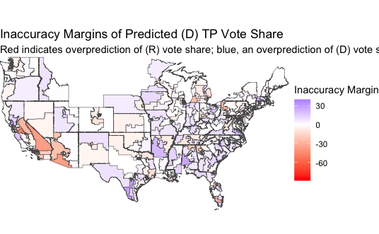
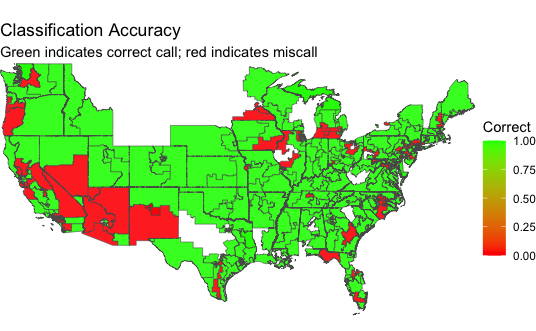

```{r setup, include = FALSE, message = FALSE}
# # Set up
knitr::opts_chunk$set(echo = TRUE)
library(tidyverse)
library(ggplot2)
library(janitor)
library(readr)
library(stargazer)
library(usmap)
library(rmapshaper)
library(sf)
library(insight)
library(scales)
library(Metrics)

state_fips <- read_csv("state_fips.csv") %>%
  rename(state_fips = state_fip) 

historical_results <- read_csv("historical_results.csv") %>%
  group_by(state, district) %>%
  summarize(count = n()) %>%
  left_join(state_fips, by = "state") %>%
  rename(state_fip = state_fips) %>%
  mutate(district = case_when(!is.na(as.numeric(district)) ~ district, T ~ "1"), geoid = as.numeric(paste0("", state_fip, "0", district))) %>%
  drop_na()

results <- read_csv("results.csv") %>%
  janitor::clean_names() %>%
  select(state_fips, fips, cd, total_vote, rankd, rankr, democratic, republican, ca_democratic, ca_republican) %>%
  mutate(state_fips = as.numeric(state_fips), fips = as.numeric(fips), democratic = as.numeric(democratic), republican = as.numeric(republican), rankd = as.numeric(rankd), rankr = as.numeric(rankr), ca_democratic = as.numeric(ca_democratic), ca_republican = as.numeric(ca_republican), total_vote = as.numeric(total_vote), geoid = as.numeric(paste0(state_fips, cd)) )

# Imputing vote data for FL, DE, MA, ME, MS from NTYTimes, Politico, and Economist
results$democratic[results$fips == 12905] = 0; results$republican[results$fips == 12905] = 1; results$total_vote[results$fips == 12905] = results$democratic[results$fips == 12905][2] + results$republican[results$fips == 12905][2]
results$democratic[results$fips == 10901] = 176494; results$republican[results$fips == 10901] = 78397; results$total_vote[results$fips == 10901] = results$democratic[results$fips == 10901][2] + results$republican[results$fips == 10901][2] + 12590
results$democratic[results$fips == 50901] = 178416; results$republican[results$fips == 50901] = 138201; results$total_vote[results$fips == 50901] = results$democratic[results$fips == 50901][2] + results$republican[results$fips == 50901][2]
results$democratic[results$fips == 25901] = 153402; results$republican[results$fips == 25901] = 96499; results$total_vote[results$fips == 25901] = results$democratic[results$fips == 25901][2] + results$republican[results$fips == 25901][2]
results$democratic[results$fips == 25902] = 178472; results$republican[results$fips == 25902] = 91100; results$total_vote[results$fips == 25902] = results$democratic[results$fips == 25902][2] + results$republican[results$fips == 25902][2]
results$democratic[results$fips == 25903] = 145507; results$republican[results$fips == 25903] = 82628; results$total_vote[results$fips == 25903] = results$democratic[results$fips == 25903][2] + results$republican[results$fips == 25903][2]
results$democratic[results$fips == 25904] = 184346; results$republican[results$fips == 25904] = 0; results$total_vote[results$fips == 25904] = results$democratic[results$fips == 25904][2] + results$republican[results$fips == 25904][2]
results$democratic[results$fips == 25905] = 198617; results$republican[results$fips == 25905] = 70694; results$total_vote[results$fips == 25905] = results$democratic[results$fips == 25905][2] + results$republican[results$fips == 25905][2]
results$democratic[results$fips == 25906] = 190062; results$republican[results$fips == 25906] = 107496; results$total_vote[results$fips == 25906] = results$democratic[results$fips == 25906][2] + results$republican[results$fips == 25906][2]
results$democratic[results$fips == 25907] = 144902; results$republican[results$fips == 25907] = 26481; results$total_vote[results$fips == 25907] = results$democratic[results$fips == 25907][2] + results$republican[results$fips == 25907][2]
results$democratic[results$fips == 25908] = 184084; results$republican[results$fips == 25908] = 80961; results$total_vote[results$fips == 25908] = results$democratic[results$fips == 25908][2] + results$republican[results$fips == 25908][2]
results$democratic[results$fips == 25909] = 193426; results$republican[results$fips == 25909] = 131936; results$total_vote[results$fips == 25909] = results$democratic[results$fips == 25909][2] + results$republican[results$fips == 25909][2]
results$democratic[results$fips == 23901] = 218630; results$republican[results$fips == 23901] = 128996; results$total_vote[results$fips == 23901] = results$democratic[results$fips == 23901][2] + results$republican[results$fips == 23901][2]
results$democratic[results$fips == 23902] = 151440; results$republican[results$fips == 23902] = 140895; results$total_vote[results$fips == 23902] = results$democratic[results$fips == 23902][2] + results$republican[results$fips == 23902][2]
results$democratic[results$fips == 28901] = 45222; results$republican[results$fips == 28901] = 122122; results$total_vote[results$fips == 28901] = results$democratic[results$fips == 28901][2] + results$republican[results$fips == 28901][2]
results$democratic[results$fips == 28902] = 107071; results$republican[results$fips == 28902] = 71380; results$total_vote[results$fips == 28902] = results$democratic[results$fips == 28902][2] + results$republican[results$fips == 28902][2]
results$democratic[results$fips == 28903] = 54422; results$republican[results$fips == 28903] = 132269; results$total_vote[results$fips == 28903] = results$democratic[results$fips == 28903][2] + results$republican[results$fips == 28903][2]
results$democratic[results$fips == 28904] = 42876; results$republican[results$fips == 28904] = 127813; results$total_vote[results$fips == 28904] = results$democratic[results$fips == 28904][2] + results$republican[results$fips == 28904][2]
results$democratic[results$fips == 22904] = 0; results$republican[results$fips == 22904] = 0; results$total_vote[results$fips == 22904] = results$democratic[results$fips == 22904][2] + results$republican[results$fips == 22904][2]
results$democratic[results$fips == 28904] = 0; results$republican[results$fips == 12905] = 0; results$total_vote[results$fips == 28904] = results$democratic[results$fips == 28904][2] + results$republican[results$fips == 28904][2]

results <- results %>%  
  left_join(state_fips, by = "state_fips") %>%
  mutate(cd = as.numeric(cd)) %>%
  rename(district = cd) %>%
  select(fips, state, district, total_vote, rankd, rankr, democratic, republican, ca_democratic, ca_republican, geoid) %>%
  mutate(actual_dem_vote = (democratic + ca_democratic) * 100 / total_vote, actual_rep_vote = (republican + ca_republican) * 100 / total_vote, actual_winner = case_when(actual_dem_vote > actual_rep_vote ~ "Democrat", actual_rep_vote > actual_dem_vote ~ "Republican"))

preds_C <- read_csv("preds_C.csv")
# preds_C[preds_C$state == "Alaska", 'district'] = 1
# preds_C[preds_C$state == "Wyoming", 'district'] = 1
# preds_C <- preds_C %>%
#   left_join(results, by = c("state", "district")) %>%
#   select(state, district, lower, upper, fitted, actual_dem_vote, winner,  actual_winner, geoid) %>%
#   mutate(correct = case_when(actual_winner == winner ~ 1, T ~ 0), margin = fitted - actual_dem_vote)
# 
# comp_d <- preds_C$geoid

preds_NC <- read_csv("preds_NC.csv") #%>%
# preds_NC[preds_NC$state == "Alaska", 'district'] = 1
# preds_NC[preds_NC$state == "Wyoming", 'district'] = 1
# preds_NC[preds_NC$state == "Delaware", 'district'] = 1
# preds_NC[preds_NC$state == "Vermont", 'district'] = 1
# preds_NC <- preds_NC %>%
#   left_join(results, by = c("state", "district")) %>%
#   select(state, district, lower, upper, fitted, actual_dem_vote, winner,  actual_winner, geoid) %>%
#   mutate(correct = case_when(actual_winner == winner ~ 1, T ~ 0), margin = fitted - actual_dem_vote) %>%
#   drop_na()
# preds_NC <- subset(preds_NC, !(geoid %in% comp_d))

missed_NC <- subset(preds_NC, correct == 0) %>%
  select(correct, state, district, actual_winner, winner, margin)
correct_NC <- subset(preds_NC, correct == 1) %>%
  select(state, district, actual_winner, margin)

missed_C <- subset(preds_C, correct == 0)  %>%
  select(correct, state, district, actual_winner, fitted, actual_dem_vote, margin)
correct_C <- subset(preds_C, correct == 1) %>%
  select(state, district, actual_winner, margin)

mean(abs(correct_NC$margin), na.rm = TRUE)
mean(abs(missed_NC$margin), na.rm = TRUE)

mean(abs(correct_C$margin))
mean(abs(missed_C$margin))

all_preds <- rbind(preds_C, preds_NC) %>%
  left_join(historical_results %>% select(geoid, count), by = c("geoid", "state") )

# write.csv(preds_C, "preds_C.csv")
# write.csv(preds_NC, "preds_NC.csv")
# write.csv(all_preds, "all_preds.csv")
```

```{r, include = FALSE}

paste0("Number of miscalled non-competitive districts: ", length(preds_NC$district[preds_NC$correct == 0]))
paste0("Number of miscalled competitive districts: ", length(preds_C$district[preds_C$correct == 0]))

paste0("Avg. margin, NC: ", mean(abs(preds_NC$margin)))
paste0("Avg. margin, C: ", mean(abs(preds_C$margin)))

paste0("Avg. margin, correct NC: ", mean(abs(correct_NC$margin), na.rm = TRUE))
paste0("Avg. margin, incorrect NC: ", mean(abs(missed_NC$margin), na.rm = TRUE))

paste0("Avg. margin, correct C: ", mean(abs(correct_C$margin), na.rm = TRUE))
paste0("Avg. margin, incorrect C: ", mean(abs(missed_C$margin), na.rm = TRUE))

```

# Overview
This week, I am revisiting my final models and predictions from [week 8](https://vivian-1372.github.io/Election-Analytics/post/2022-11-07-final-prediction/) and reflecting on how they performed, and speculating about why, now that we're about 2 weeks post-Election Day now.

# My Final Model and Predictions
## National Model
My national modeling addressed two main goals: predicting the 2022 House incumbent party two-party vote share and predicting the 2022 House incumbent party seat count. My main model consisted of a linear regression built off of 4 predictors (GDP absolute growth, generic ballot support for the House incumbent party, whether or not it was a midterm year for the incumbent/President's party, and the congressional approval rate). To achieve the two goals, I swapped out the response variable as needed. 

Ultimately, I predicted that the House incumbent party (Democrats this year) would earn 48.56% (47.36, 49.83) of the national two-party vote share and 209 (198, 221) seats.

## District-Level Models
My district-level modeling also consisted of two main goals: predict the vote share of the democratic candidate in competitive districts and predict the vote share of the democratic candidate in "non-competitive" districts. My approach was to build competitive linear regression models using average expert ratings of those races in addition to  candidate incumbency status, and to build non-competitive ones using the last democratic candidate's vote share as well as the current candidate's incumbency.  

# Evaluation 
## Accuracy 
As of November 22, 2022, the Democrats have reportedly captured 48.47% of the two-party vote share and 213 of the 435 seats (Cook Political Report, NYTimes).

A quick glance tells us that my national model's national vote share prediction was within 0.5 percentage points of the actual, and seat count prediction was off by 4 seats.  

The table below provides a more detailed report on the accuracy of my national and district-level models, with measures of root mean squared error (RMSE), number of miscalled districts, classification accuracy, and the average margin by which the predicted vote shares were inaccurate. 

```{r RMSE table, echo = FALSE}

# National Vote Share comes from Cook Political Report's National Two Party Vote Share
RMSE_df = data.frame( c("(D) National Two-Party Vote Share", "(D) TP Vote Share, Non-Competitive Districts", "(D) TP Vote Share, Competitive Districts"), c(rmse(48.56, 48.47005476), rmse(preds_NC$fitted, preds_NC$actual_dem_vote), rmse(preds_C$fitted, preds_C$actual_dem_vote)), c("-", "25/306", "46/94"), c("-", "0.92", "0.51"), c("-", round(mean(abs(preds_NC$margin)), 2), round(mean(abs(preds_C$margin)), 2)))

colnames(RMSE_df) = c("Model", "RMSE", "Miscalled Districts", "Classification Accuracy", "Avg. Inaccuracy Margin")

export_table(RMSE_df, format = 'html')

```

My national vote-share prediction was considerably close, with a somewhat tight confidence interval of (47.36, 49.83) and center of 48.56%. As shown above, the RMSE of my national prediction is very small. That said, it was the simpler half of my modeling, with no purview into how each district-level race would play out.  

The performance of my district-level models was a little less impressive, with RMSEs of 13.47 and 12.03 for the non-competitive and competitive models respectively. Though the non-competitive models had higher RMSE and average inaccuracy margin (which I define as the average difference between the actual Democratic candidate vote share and my prediction), they have a much higher classification accuracy than the competitive models. This was initially counterintuitive, but ultimately makes sense considering that the competitive models have a much harder classification task, with each race being close - even very small swings in vote share can alter each district's outcome and classification. In contrast, the non-competitive models can afford to be less accurate in vote-share prediction so long as they correctly call the outcome. Indeed, over 90% of incumbents win re-election, so the inclusion of incumbency was expected to help call the non-competitive races accurately (OpenSecrets). Though, in retrospect, the incumbency variable wasn't informative enough to accurately predict *vote share* with high accuracy in these districts, as reflected by their large RMSEs and inaccuracy margins. 

```{r viz code, include = FALSE}
# load geographic data
# get_congress_map = function() {
#   tmp_file = tempfile()
#   tmp_dir = tempdir()
#   download.file("https://cdmaps.polisci.ucla.edu/shp/districts114.zip", tmp_file)
#   unzip(zipfile=tmp_file, exdir=tmp_dir)
#   fpath = paste(tmp_dir, "districtShapes/districts114.shp", sep="/")
#   st_read(fpath)
# }
# # Get the district map
# districts = get_congress_map()
# districts$DISTRICT = as.numeric(districts$DISTRICT)
# 
# fips = select(read_csv("incumb_dist_1948-2022.csv", show_col_types = FALSE), st_cd_fips, state, district_num) %>% 
#   unique() %>% 
#   mutate(geoid = as.numeric(st_cd_fips)) %>%
#   rename(district = district_num)
# fips$district = as.numeric(fips$district)
# districts = left_join(districts, fips, c("STATENAME" = "state", "DISTRICT" = "district"))
# districts_simp = ms_simplify(inner_join(districts, all_preds, "geoid"), keep = 0.01)
```

Below are maps of the congressional districts I made predictions for, the first being colored according to how close (or far) my two-party vote share predictions were, and the second being colored by correct-call or miscall status. 

```{r margin vizz, echo = FALSE}

# ggplot() +
#   geom_sf(data=districts_simp, aes(fill=margin),
#           inherit.aes=FALSE, alpha=0.9) +
#   scale_fill_gradient2(low="red", mid="white", high="blue", name="Inaccuracy Margin") +
#   coord_sf(xlim=c(-124.8, -66.9), ylim=c(24.5, 49.4), expand=FALSE) +
#   theme_void() +
#   theme(axis.title.x=element_blank(),
#         axis.text.x=element_blank(),
#         axis.ticks.x=element_blank(),
#         axis.title.y=element_blank(),
#         axis.text.y=element_blank(),
#         axis.ticks.y=element_blank()) + 
#   ggtitle(label = "Inaccuracy Margins of Predicted (D) TP Vote Share", subtitle = "Red indicates overprediction of (R) vote share; blue, an overprediction of (D) vote share") 

```


Overall, it seems I tend to overpredict the Democratic candidate's vote share, especially in the South. However, my single largest inaccuracy was in Maryland 6, where I severely underpredicted the (D) vote share and overpredicted the (R) vote share. Other than that miscall, my underpredictions of (D) performance were concentrated in southern California and western Arizona. In fact, 16 of my 25 non-competitive misclassifications come from California and Arizona, with 14 from California alone.   

I produced the map below to help evaluate my models' classification performances at a glance. Red denotes a miscalled or misclassified district, and green denotes a correct call. 

```{r classification viz, echo = FALSE}
# ggplot() +
#   geom_sf(data=districts_simp, aes(fill=correct),
#           inherit.aes=FALSE, alpha=0.9) +
#   scale_fill_gradient2(mid="red",  high="green", name="Correct") +
#   coord_sf(xlim=c(-124.8, -66.9), ylim=c(24.5, 49.4), expand=FALSE) +
#   theme_void() +
#   theme(axis.title.x=element_blank(),
#         axis.text.x=element_blank(),
#         axis.ticks.x=element_blank(),
#         axis.title.y=element_blank(),
#         axis.text.y=element_blank(),
#         axis.ticks.y=element_blank()) + 
#   ggtitle(label = "Classification Accuracy", subtitle = "Green indicates correct call; red indicates miscall") 

```



My models had the most trouble predicting the outcomes and vote shares of districts in the Southwest and West, located in California, Nevada, Arizona, and New Mexico. There are also pockets of misclassification across the Great Lakes states, but they don't appear particularly concentrated in any one area. 
Interestingly, my models did particularly well in New York, which was a state of difficulty for both FiveThirtyEight and The Economist. Both models miscalled NY-3, NY-4, NY-17, NY-19, and NY-22, but mine only did so for NY-4 and NY-17, with inaccuracy margins of just 5.5 and 0.9 percentage points. 

## Inaccuracy Sources 
There are many ways to explain the inaccuracy of my district models. I have several hypotheses regarding redistricting, turnout, and coding decisions that I believe decreased the accuracy of my predictive models at the district level. 

### Redistricting
One of the main sources of inaccuracy in my model is likely the redistricting that occurred in 2020. All of the data I used to build out my OLS models came from 2020 and prior, so my models are not perfectly tuned to the sentiments and voting behavior of the citizens in each 2022 congressional district. In Texas, Montana, and Florida, Republicans have gained new safe districts; in Colorado, Oregon, and North Carolina, Democrats did the same (Politico). The two maps above demonstrate how poorly my models performed in these states, with the training data not properly matching the regions for which I made 2022 predictions for due to the redistricting war. 

### Turnout
Post-election, it is clear that including a turnout in the model in some way would've been very helpful in gauging who will come out to vote, and who their vote will be cast for.  

#### Youth Turnout
This year, young (19-29) turned out in historic numbers (CIRCLE). Some pundits and analysts believe it is the youth vote that helped Democrats stave off a "Republican wave", with youth turnout being the second-highest it's been in the last 30 years and youth preferring Democratic candidates over Republican ones by a 28-point margin. In key battleground states, the margin was even larger for the youth vote in competitive senatorial and gubernatorial races. This youth vote could partially explain how Democrats overperformed what my model predicted and had a particularly strong year as the president's party in an arguably poor economy, and I believe my lack of consideration of a youth turnout variable led to an underprediction of Democrat seat count. 

#### General Turnout 
Another theory related to turnout is that high-profile senatorial and gubernatorial races in certain states (such as Arizona, Nevada, Pennsylvania, and Georgia) this year may have incentivized higher Democratic voter turnout than other years due to perceived threats to abortions rights, democracy, party power, and more. This increased turnout could have led to down-ballot success for the Democratic party, and again, my lack of variable to account for particularly high-profile, high-turnout races likely led to an underprediction of Democratic candidate success in affected regions and races.  

### Coding
Most of my competitive-district models were trained on low quantities of past data, since expert ratings were required and can only be found dating back to 2010 - so, 5 midterms to train on. This meant that I had to sacrifice data quantity in order to incorporate expert ratings into my competitive model. In retrospect, I believe that such low amounts of training data resulted in underfitting in some cases, as there weren't enough consistent trends to learn from for certain districts, and overfitting in other cases, such as when certain districts had severely lopsided support for one party in all 5 training data points, but underwent redistricting and/or significant changes this election cycle. As a result, the competitive models weren't particularly accurate at predicting the vote share and outcome of the 94 most competitive districts.

I also believe that (lack of) coding for uncontested races was a source of error in my models. After developing my competitive and non-competitive models, I made predictions for this year's Democratic candidates. However, certain races were uncontested, and yet, still treated like the other standard multi-candidate races. Failing to account for uncontested races introduced unnecessary work into my model prediction process, and allowed for inaccuracy margins that shouldn't have existed. For example, California 15, 16, 29, 30, 34, and 37 were all uncontested (no Republican candidates) races where Democrats candidate earned all 100% of the two-party vote share. I called all of these districts correctly, but unfortunately gave non-100 vote share predictions. 

## Testing Inaccuracy Hypotheses
Below I propose some simple tests to quickly see if the above sources of inaccuracy were indeed difference-makers in how my models performed this year. 

### Redistricting
To test my hypothesis about the negative effect of redistricting on my model performance, I could run the models again after correcting for redistricting. Mapping the train data by region to the new corresponding district, or mapping the new election data to old district lines, would adequately account for redistricting changes, and my new predictions can be evaluated the same way my current predictions are. A comparison of RMSEs, classification accuracies, and average inaccuracy margins should reveal just how much redistricting threw off my 2022 models. 

### Turnout
Youth turnout percentage could have been included as a predictor in my models, assuming the data is available as far back as the training data requires. As for high-profile races, an indicator variable for Senate race in the state or variable for the number of ballot measures could've been included. Again, we could compare the performance of these new models to that of the current ones to see how much, if at all, turnout was predictive of race outcomes. 

### Coding
After adding in an indicator variable for un/contested seat in both the competitive and non-competitive versions of the district models and acquiring more longitudinal data so that the number of training data points is sufficiently large (or at least greater than the 5 we're currently working with), we could conduct a test like a difference-in-means test to see if there's a meaningful difference in model performance (classification accuracy, mean inaccuracy margin of vote share prediction, etc.) when we change the training data and processing of candidates. 

# Looking Forward
I have several ideas for improvement in model performance and creation should I do this again (which I probably will, because this has been great fun and very intellectually rewarding). 


```{r echo = FALSE, out.width = "95%", fig.cap = 'Source: Election Analytics 2022.'}
knitr::include_graphics("election24.png")
```

Broadly, I'd make a few changes on the approach-side: split national vote share and national seat count into two different linear regression projects (allowing for different predictors in each model), spend more time tuning my district-level models with expert ratings and fundamental predictors, and study the experts' models more closely. I tried my best to use the literature and lectures reviewed in Gov 1347, as well as my own insights, to build out this year's models with the primary goal of learning, but next time, I plan to improve more directly on models from professional forecasters like The Economist and FiveThirtyEight with heavier prioritization on model performance and prediction accuracy. 

## Model Choice
Alongside those general approach improvements, I also envision some related specific technical ones regarding model choice and variable selection. I touch on model choice first; now that I've created, trained, validated, and predicted with over 400 OLS linear regression models, I feel ready to try more advanced modelling methods like Random Forest or bagging that don't assume linearity. Ideally, I'd be able to get linear regression and Random Forest models up and running far in advance of the midterms to compare them. I'd also like to pool my district-level models next time around should they end up linear again. 

Another model-related change I'd really like to make is to run simulations to get probabilities of Democrat and/or Republican wins in each district. This should increase at-a-glance interpretability, and also allow for post-election Brier score calculations. 

## Variables
As mentioned in my discussion of potential sources of inaccuracy, I'd like to consider youth turnout, high-profile race-presence, and seat contested-ness in my next rounds of variable selection. Below are some additional variables that are interesting to consider closely. 

### Economic Variables
In the construction of my national model, I struggled somewhat to pick the best economic variable to include, settling finally on GDP growth in absolute terms. Though it was certainly predictive, I felt that it was hard to interpret and justify, so I hope to find better economic variable(s) in my next attempt. I also hope to find some variables that are data-dense even at the district level so that I can try to come close to a truly fundamentals-based forecast of districts. 

### Candidate Quality
There's been a lot of chatter about the impact of Trump endorsements on the performance of Republican candidates and on how the 2022 midterms played out. I would like to consider candidate quality more closely in my 2024 attempt. This could involve many variables, such as fundraising abilities, presidential endorsements, and polling numbers. We briefly discussed the differential impacts of endorsements in class, so perhaps an interaction term of `presidential_endorsement` * `endorsers_last_vote_share` or `endorsers_approval_rating` could capture the possible effects of a presidential endorsement. 

### Special Election Performance
A week after Election Day, Elliott Morris (who we had the pleasure of hosting as a guest speaker to our course in October) and Dan Rosenheck of the Economist wrote that special election results in each midterm cycle are generally very good predictors of actual two-party vote share, being even more accurate than the generic-ballot polls (The Economist). My national model greatly benefited from the addition of generic ballot numbers, so I look forward to seeing how special election results stack up. 

## Final Reflections
As I finish reflecting upon my 2022 forecasts and I look forward, I realize that I've learned a great deal developing these election forecasts over the past 9 weeks. It's been a pleasure sharing my insights and lessons learned with you, and I thank you for following along. Every week's brought a new challenge, and I've gained something from each one. See you next week for the last installment of this analytical blog series of the Fall 2022 semester! 

---
**References**

[1] New York Times. House Elections Results. https://www.nytimes.com/interactive/2022/11/08/us/elections/results-house.html

[2] Cook Political Report. National House Vote Tracker. https://www.cookpolitical.com/charts/house-charts/national-house-vote-tracker/2022

[3] OpenSecrets. Reelection Rates. https://www.opensecrets.org/elections-overview/reelection-rates

[4] Politico. How redistricting shaped the midterms. https://www.politico.com/news/2022/11/25/redistricting-midterms-00070810

[5] CIRLCE Tufts. 2022 Election: Young Voters Have High Midterm Turnout, Influence Critical Races. https://circle.tufts.edu/2022-election-center

[6] NPR. How Democrats were able to perform better than expected in midterm elections. https://www.npr.org/2022/11/14/1136423401/how-democrats-were-able-to-perform-better-than-expected-in-midterm-elections

[7] The Economist. Off the Charts. https://view.e.economist.com/?qs=7500b25b1dd36174acf4cb8d6b52bfe7af9fb996a5e035e6098c9807d71053a6be4b87bbd44d0a5af6dbdd6c6924c8d13a914d9d45452f4966d3df19d5cd02c3c9d0aae0cb5443269594ef72e4e5d926