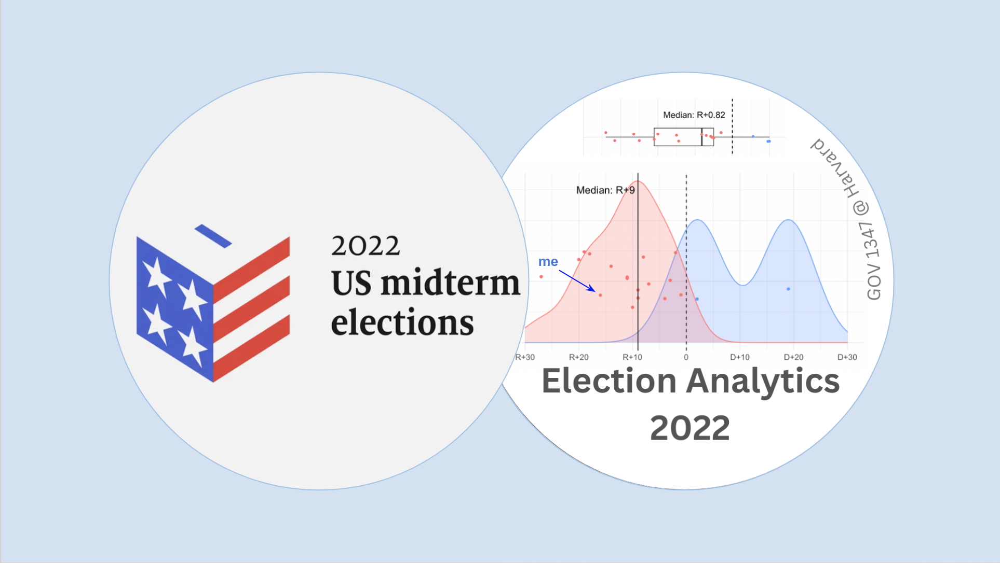

# The Plan Today
I couldn't end this series without saying a few final remarks, so here we are! It's been a long and rewarding journey of learning and adapting, so I wanted to summarize a few of the top lessons learned, give thanks, and look forward.  

# Final Remarks
I've learned a lot this semester, and much of it has been through guided trial-and-error. Looking back, I feel very proud of all the work I've done, and how accurate my models were, especially given that they were my first real shots at forecasting U.S. elections. Looking forward to the predictive challenges to come in 2024, and generally, what else data science can tell us about government and people. 

## Lessons Learned 
1. Good data is pretty hard to come by, still. For me, some of the best resources so far have came from the GOV 1347 teaching team, FiveThirtyEight, PewResearch, Dave Leip, and Wikipedia. 
2. Build out national seat share and national vote share models separately. When switching out independent variables, consider different combinations of dependent ones, even if the independent variables are closely related.  
3. Fundamentals (incumbency, past electoral history, the economy) are highly, highly predictive for district-level models. This is especially important in relation to lesson #1, since there's generally more historical fundamentals data available than campaign or dynamics data. 
4. Incorporate more creative predictors. Drawing directly or indirectly from the literature, don't be afraid to create new variables that may be predictive. For example, in House races, try an indicator variable for a Senate or gubernatorial race being on the ballot. In any race, test Vavreck's campaign messaging theory by incorporating a variable that speaks to the campaign's success at conveying an insurgent or clarifying message. 
5. Stay open minded and adaptive. As a great professor once told me, social science is hard. Elections are, in many ways, predictable. But it's very, very difficult to get it right on the nose, with all the forces and factors in the world influencing how people think and vote. Additionally, the elections we try to forecast only happen once every two or four years, so not only is data scarce, but so are trials. There will always be new predictors to consider, like The Economist's suggestion of special election performance or a newly popular insurgent campaign issue like abortion, so keep an eye out, try new methods and predictors, and stay committed to good science (confidence intervals, probabilistic forecasting). 

## Thank Yous
I want to thank Professor [Ryan Enos](https://www.ryandenos.com/) and Teaching Fellows [Kiara Hernandez](https://gov.harvard.edu/people/kiara-hernandez) and [Yao Yu](https://itsyaoyu.com/) for their compassion and patience, hard work providing us with data for analysis, and most importantly, delivery of the tools and knowledge we needed to learn the science, and art, of election analytics. From paired discussions to technical labs to the coolest guest speakers, every learning opportunity has been appreciated.  

Thank you to all of my [classmates](https://itsyaoyu.github.io/Harvard-ElectionAnalytics-2022/) in GOV 1347: Election Analytics, who came from many different academic backgrounds, for their insights and support as we've built out our models together. 

It's been a genuine pleasure learning from you all!

## Onto the Next! 
As of December 7, 2022, I plan to commit to this forecasting journey again for the 2024 elections. The presidency, all 435 House seats, and 34 Senate seats will be up for grabs, and I hope to go bigger and better, with (probabilistic) forecasts for all, or most, of them. I will also have freshly graduated Harvard College by then, so it will really be an interesting time. 

Hopefully, talk to again you then! 

Best wishes,

Vivian