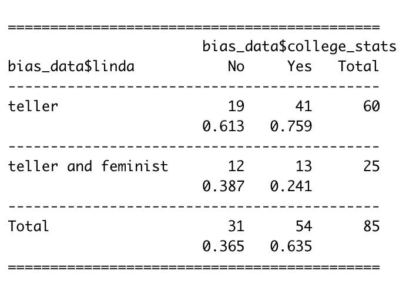
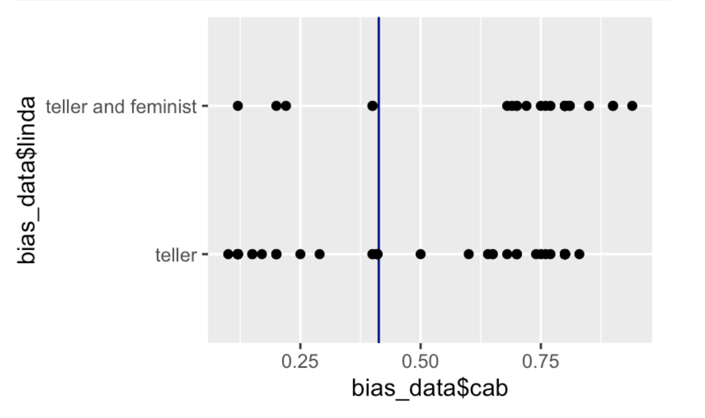
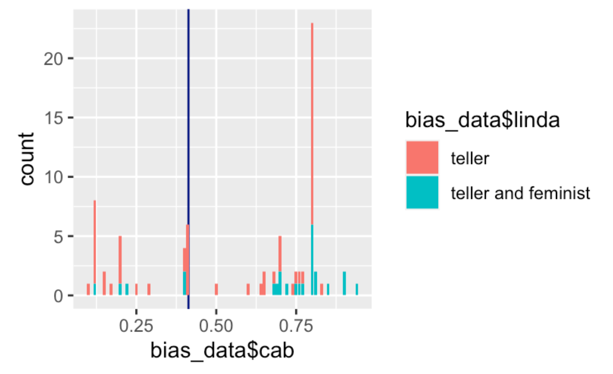
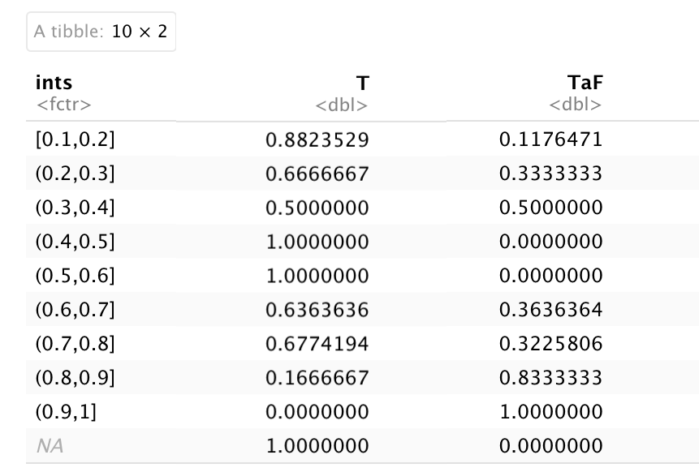

```{r setup, include=FALSE}
knitr::opts_chunk$set(echo = FALSE, include = FALSE)

library(dplyr)
library(readr)
library(ggplot2)
library(estimatr) # difference_in_means()
library(tidyverse)
library(descr)

```

```{r biases, message = FALSE, include = FALSE}
# load the class-generated bias data
bias_data <- read_csv("bias_data.csv")
```

# Introduction
This is the first Data Exploration task of Fall 2021! Welcome. This week, my classmates of Government 1372 (Political Psychology) and I worked with our in-class survey results to observe how susceptible we are to cognitive biases and discuss how that may affect our decision-making.

# Data Details
*File Name: bias\_data.csv


*Source: These data are from last week's in-class survey. 
Variable Name         | Variable Description
--------------------- | --------------------------------------
id         | Unique ID for each respondent
rare\_disease\_prog  | From the rare disease problem, the program chosen by the respondent (either 'Program A' or 'Program B')
rare\_disease\_cond  | From the rare disease problem, the framing condition to which the respondent was assigned (either 'save' or 'die')
linda  | From the Linda problem, the option the respondent thought most probable, either "teller" or "teller and feminist"
cab | From the cab problem, the respondent's estimate of the probability the car was blue
gender  | One of "man", "woman", "non-binary", or "other"
year  | Year at Harvard
college\_stats  | Indicator for whether or not the respondent has taken a college-level statistics course

# The Linda Problem
"Linda is 31 years old, single, outspoken, and very bright. She majored in accounting. As a student, she was deeply concerned with issues of women's rights, and also studied economics.

Which is more probable: Linda is a bank teller, or Linda is both a teller and feminist?"

```{r}
linda_correct <- bias_data %>%
  group_by(linda) %>%
  summarise(count = n(), prop = n() / 85)

linda_correct
```
70.59% of the class answered this question correctly. While the majority of our class was able to choose the right answer, many people in general tend to choose the wrong option. This occurs because many people think that given information about someone, the information makes something more likely about them. When we know that Linda is interested in social activism, we think it is not surprising for her to be a feminist. Most people, however, are not aware of the probability principles of the Linda question -- or they simply ignore the principle because the seemingly logical connection between what we know about Linda and what could be true is too convincing in the moment.

# The Cab Problem
"A cab was involved in a hit and run accident at night. Two cab companies, the Green and the Blue, operate in the city. 85% of the cabs in the city are Green and 15% are Blue.
  
A witness identified the cab as Blue. The court tested the reliability of the witness under the same circumstances that existed on the night of the accident and concluded that the witness correctly identified each one of the two colours 80% of the time and failed 20% of the time.
  
What is the probability that the cab involved in the accident was Blue rather than Green knowing that this witness identified it as Blue?"

That said, the most common response was 0.8.

## Extension
So then, what attributes of the respondents might affect how they answered the Linda problem and why? 
```{r}
linda_cab <- bias_data %>% 
  group_by(linda) %>%
  summarise(count = n(), cab_avg_guess = mean(cab))
linda_cab

linda_cab_T <- bias_data %>% 
  group_by(ints = cut_width(cab, width = .10, boundary = 0)) %>%
  summarise(T = mean(linda == "teller"))
linda_cab_T

linda_cab_TaF <- bias_data %>% 
  group_by(ints = cut_width(cab, width = .10, boundary = 0)) %>%
  summarise(TaF = mean(linda == "teller and feminist"))
linda_cab_TaF
```

```{r}
CrossTable(x = bias_data$linda, y = bias_data$college_stats, prop.r = FALSE, prop.c = TRUE, prop.t = FALSE, prop.chisq = FALSE)

ggplot(bias_data, aes(x = bias_data$cab, y = bias_data$linda)) +
    geom_vline(aes(xintercept = .413), col = "navy") + 
    geom_point()

ggplot(data = bias_data, mapping = aes(x = bias_data$cab, fill = bias_data$linda)) + 
  geom_vline(aes(xintercept = .413), col = "navy") + 
  geom_bar()
```
```{r}

CrossTable(x = bias_data$linda, y = bias_data$gender, prop.r = FALSE, prop.c = TRUE, prop.t = FALSE, prop.chisq = FALSE)
```
```{r}
CrossTable(x = bias_data$linda, y = bias_data$year, prop.r = FALSE, prop.c = TRUE, prop.t = FALSE, prop.chisq = FALSE)
```

I would guess that college statistic education, age, responses to the cab question could correlate to students' answers to the Linda question. 
```{r, echo = FALSE, include = FALSE}
ggplot(data = bias_data, aes(x = cab)) +
  geom_histogram(binwidth = 0.05) + 
  geom_vline(aes(xintercept = .8), col = "red") +
  labs(title = "Taxi Cab Student Responses",
       x = "P(Blue | Identified as Blue)",
       y =  "Number of Student Guesses")
```

To explore this question, I first examined the crosstable of responses to the Linda question sorted by respondents who had taken a college statistics course versus those who had not. 


<!--   --> 

```{r, echo = FALSE, out.width='100%', fig.cap='Linda Statistics'}

```

From this table, we see that students with at least some formal statistics knowledge are more likely to answer the Linda question correctly. 75.9% of statistics students correctly answered that Linda was more likely to be only a teller, while only 61.3% of non-statistics students were able to do so. Despite the non-statistics-student group being much smaller than its counterpart group (31 versus 54 people), both groups contain a similar quantity of students who responded incorrectly – 12 and 13. From these proportions, we can see that respondents who have not taken a college-level statistics course are more likely to use the attribution substitution shortcut to form conclusions about who Linda is. Because the question provides that Linda is outspoken about issues of activism and seems liberal, a heuristic that leads observers to a statistical fallacy – believing that Linda must then be a feminist too – is readily available. Observers don’t actually know if Linda is a feminist, so they substitute the attribute in question with more known ones, such as her activism. However, if observers pay closer attention, their System 2 may remind them of the statistical principle that states “a conjunction of two events can’t be more probable than either of the events occurring by itself.” Of course, previous students of statistics are more likely to remember this principle before allowing their intuitive heuristics to decide Linda’s character for them. 

Understanding that students with some statistical background fare better when facing heuristics pitfalls, I wanted to explore the relationship, if any, between responses to the Linda question and responses to the blue cab question. How likely is it that the cab is actually blue? Is Linda a teller with feminist hobbies? These questions are hard to answer with certainty, so do respondents use heuristics to form conclusions about these questions? To look at how these questions’ responses interact, I plotted the Linda responses versus the blue cab responses. I also graphed a vertical line at the actual, statistically correct probability of the identified cab being a blue cab in navy blue, p = 0.41. 

<!--  -->

```{r image 1, echo = FALSE, out.width='100%', fig.cap='Linda Responses'}

```

From this plot, I noticed that those who labeled Linda “teller and feminist” tended to believe that there was a high likelihood that the cab was actually blue. Some respondents who correctly answered the Linda question also thought that the cab was blue, with many responses concentrated over the p = 0.70 mark. However, the “teller” group had many more responses on the lower end of the cab probabilities than the “teller and feminist” group. This indicates to me that the former group perhaps had some intuition that the cab was less likely blue than the question initially would suggest. I then plotted the same data as a bar graph to get another visual.

<!--  -->

The majority of people who were correctly skeptical of the blue car ID are those at or near the navy vertical line. Those to the left of the vertical line also seem to have reason to believe that the likelihood of the car actually being blue is much closer to the base rate than 0.80, the most common response from our survey. As shown in the segmented bar graph, most of the respondents who were able to show correct or somewhat promising reasoning about the blue cab problem (those at or to the left of the vertical line shown at 0.41) are part of the “teller” group, the same students who answered the Linda question correctly. I believe there is a correlation between the ability of respondents to respond correctly to the Linda problem and the ability of those same respondents to answer the cab question correctly. Because both Linda and the cab are questions that require some statistical knowledge to figure out, the responses to these questions may be related in a way that is worth investigating. Though I do not know how to properly look at the correlation between these responses using R yet, I attempted to observe that using a crosstable of blue-cab-probability-responses versus linda-feminist-status-responses next. 

<!--  -->

Sorting the responses to the cab question into intervals of width 0.10, I observed how often respondents in each interval answered the cab question correctly (T = “teller”) versus incorrectly (TaF = “teller and feminist”). As hypothesized, respondents who were correctly suspicious of the blue ID of the car (so those who answered that the cab was only ~30-50% likely to be blue) were often the same group of people to know that Linda was more likely only a teller. The higher cab guesses, p = 0.8 and up, were more often wrong about Linda. Thus, I conclude that if a respondent ignores the base rate of blue cabs and responds with a higher probability (such as p = 0.8 or p = 0.85), then they are more likely to use attribute substitution to answer the Linda question than respondents who were able to statistically reason their way to the correct estimate for the cab color’s likelihood. 

Investigating the traits or behaviors of respondents who answer the Linda question correctly or incorrectly was very interesting to me as an initial data exercise. The data gathered from our class survey confirms, especially with the cab problem, that humans are not always able to use our System 2’s and logically reason through confusing questions. What makes respondents more likely to answer the Linda question correctly? After this investigation, I understand that college statistics background has some pull. I also understand now that the respondents’ ability to answer different challenging questions, such as the blue cab one, may indicate their ability to statistically reason and answer our Linda question of interest. Probability and statistics skills are not the most intuitive to most humans, and yet the ability to leverage them has shown to be significant in our class’ responses to seemingly simple survey questions.

---

**References**


[1] Kahneman (2003)
